# Monolithic to Microservice Cloud Native Development -- Autonomous Microservice Data Structure Configuration

  

## Introduction

In this lab you will use your Oracle Cloud Trial Account to upload a Data Pump export file to Object Storage and leverage SQL Developer to import the Data Pump export file into an Autonomous Transaction Processing (ATP) Database.

***To log issues***, click here to go to the [github oracle](https://github.com/oracle/learning-library/issues/new) repository issue submission form.

## Objectives

- Clone GIT Repository
- Create Object Storage Bucket and Upload Data Pump Exprt File to the Bucket
- Create an Oracle Cloud Infrastructure (OCI) User and Gernerate Auth Token
- Setup SQL Developer Connection to Autonomous Transaction Processing (ATP) Database
- Create ATP Database user and DBMS_CLOUD Credential
- Import Data into ATP Database using SQL Developer Data Pump Import Wizard
- Download and Review Data Pump Import Log

# Clone GIT Repository

### **STEP 1**: Open a Terminal Window and Clone GIT Repository

While still connected to the Client Image using VNC Viewer, complete the following step to clone the GIT Repository.

  - Right-click on the Desktop and select ```Open Terminal```

	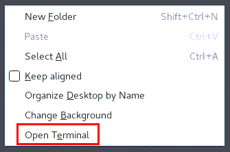

  - Within the open Terminal Window, issue the following GIT Command

	```
	git clone https://github.com/derekoneil/monolithic-to-microservice.git
	```

	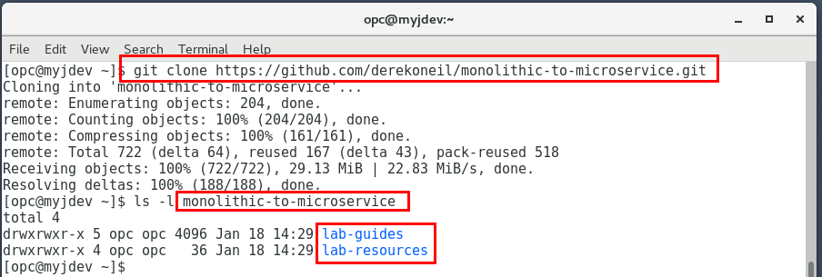

	**Note:**  The GIT clone creates the ```monolithic-to-microservice``` directory which contains contents used throughout the labs.

# Object Storage Setup, OCI User Creation and Auth Token Generation

### **STEP 2**: Log in to your OCI dashboard

  - From any browser go to

    [https://cloud.oracle.com/en_US/sign-in](https://cloud.oracle.com/en_US/sign-in)

  - Enter your **Cloud Account Name** in the input field and click the **Next** button.

	

  - Enter your **Username** and **Password** in the input fields and click **Sign In**.

	

  - In the top left corner of the dashboard, click the **Guided Navigation Drawer**

	

  - Click to expand the **Services** submenu, then click **Compute**

	

### **STEP 3**: Create Object Storage Bucket

  - Click the **Menu icon** in the upper left corner to open the navigation menu. Under the **Core Infrastructure** section, select **Object Storage** then **Object Storage** .

	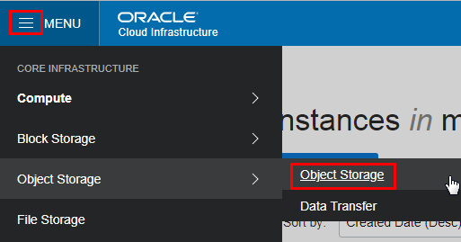

  - Select the **Compartment** `monoTOmicro` and click **Create Bucket**

	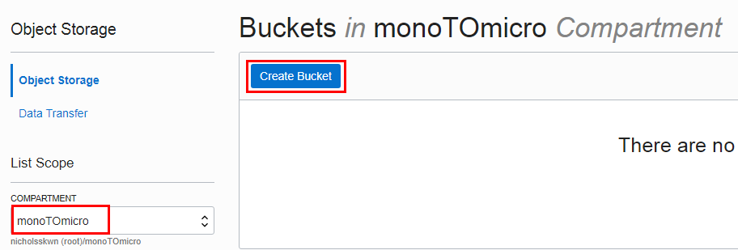

  - In the **Bucket Name** field, enter `atpData` and click **Create Bucket**

	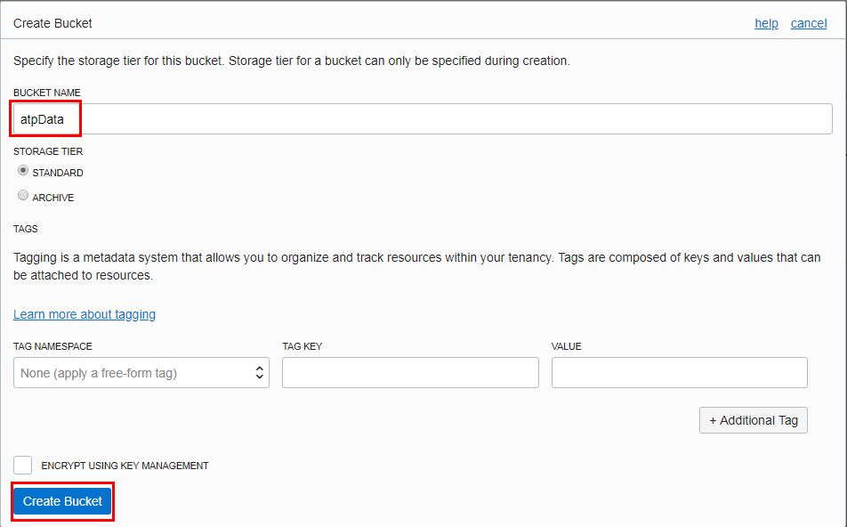

  - In a moment, your new Object Storage Bucket will show up in the list

	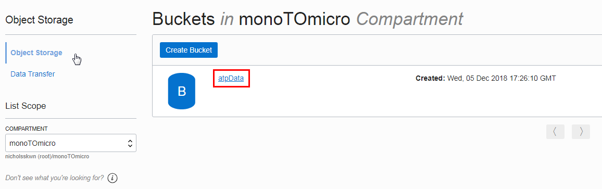

### **STEP 4**: Upload Data Pump File into Object Storage Bucket

  - Click on the `atpData` Bucket and click **Upload Object**

	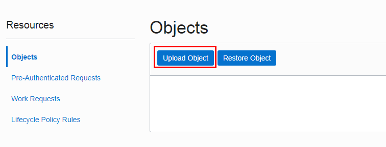

  - **Browse** or **Drag/Drop** the Data Pump DMP `.../monolithic-to-microservice/lab-resources/database/expdp_alpha121.dmp` included in the GIT repository you cloned earlier. Click **Upload Object**

	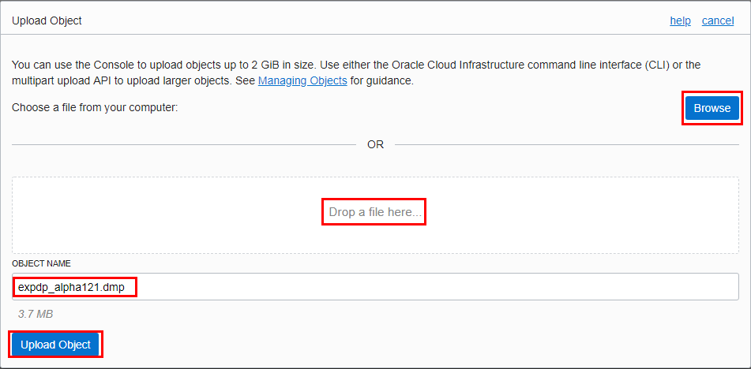

	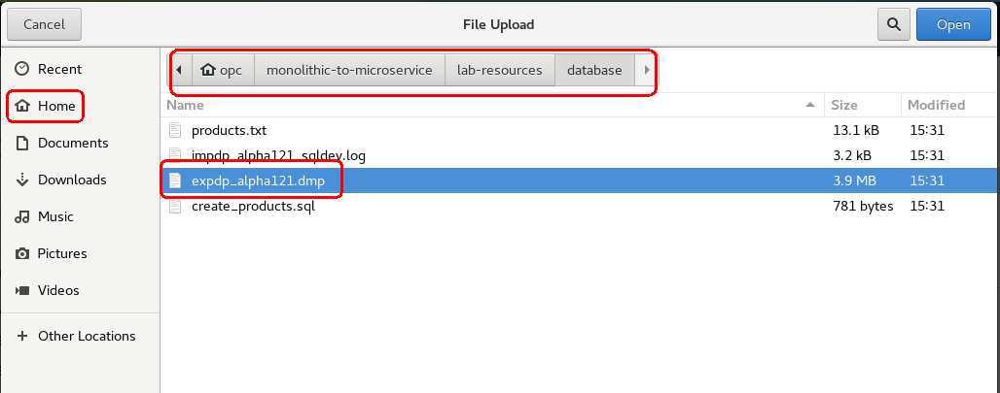

  - In a moment, the file will be uploaded to Object Storage

	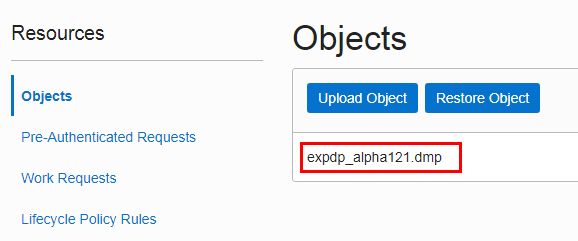

### **STEP 5**: Create OCI User

  - Click the **Menu icon** in the upper left corner to open the navigation menu. Under the **Governance and Administration** section, select **Identity** and select **Users**.

	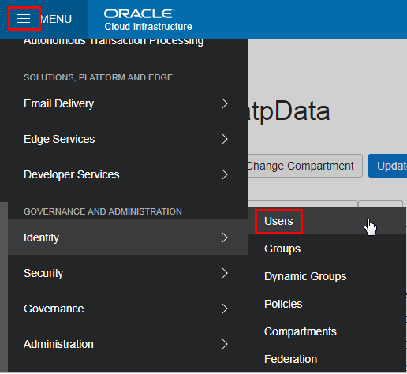

  - Click **Create User**

	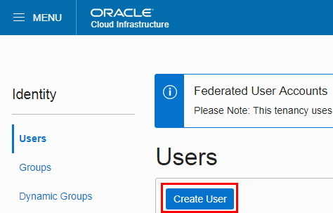

  - Enter the **Name** `impdp-ATP` and desired **Description** and click **Create**

	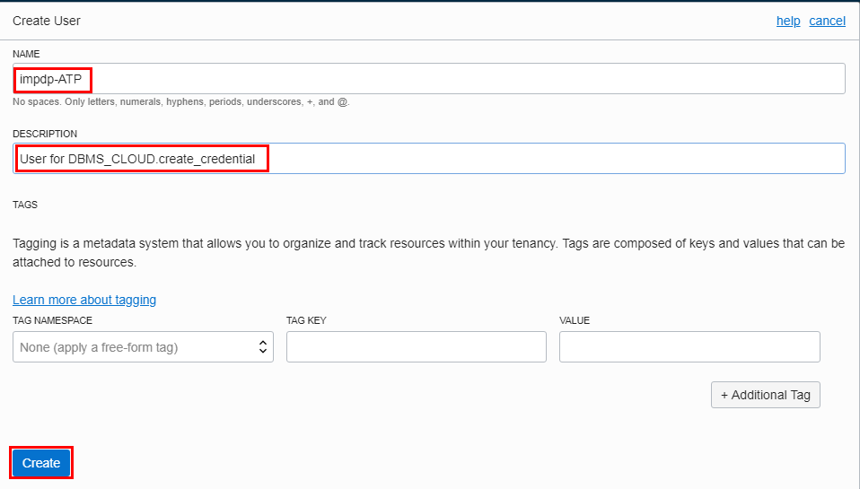

  - In a moment, your new user will show up in the list

	

  - Click on the new user `impdp-ATP`, select the **Resource** `Groups` and click **Add User to Group**

	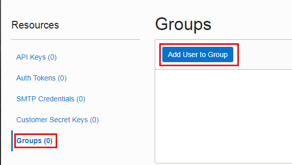

  - Select the `Administrators` group and click **Add**

	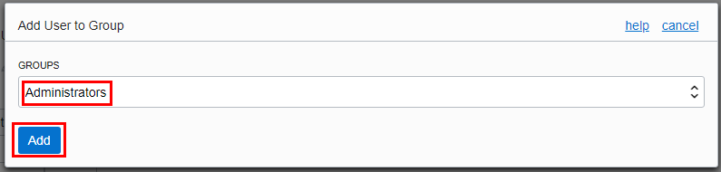

### **STEP 6**: Generate Auth Token for OCI User

  - For the new user `impdp-ATP`, select the **Resource** `Auth Tokens` and click **Generate Token**

	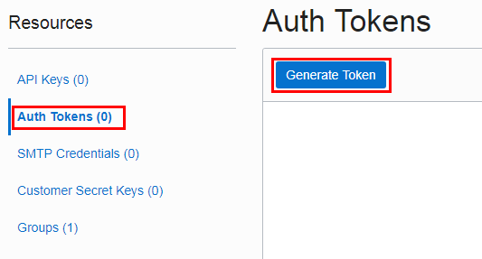

  - Enter a **Description** and click **Generate Token**

	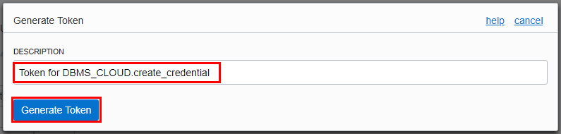

  - Click **Copy** and save the value of the **Generated Token** in a text document. You will need it later when executing the **DBMS_CLOUD.create_credential** Package.

	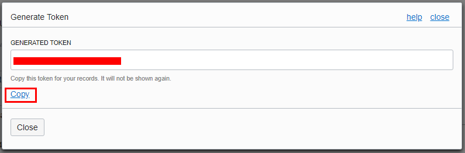

# Setup SQL Developer Connection to ATP, Create Database User and DBMS_CLOUD Credential in ATP

### **STEP 7**: Download ATP Wallet Zip File

  - Click the **Menu icon** in the upper left corner to open the navigation menu. Under the **Database** section, select **Autonomous Transaction Processing**.

	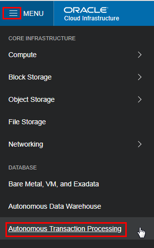

  - Select the **AlphaOffice** ATP Database

	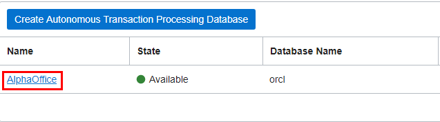

  - Click **DB Connection**

	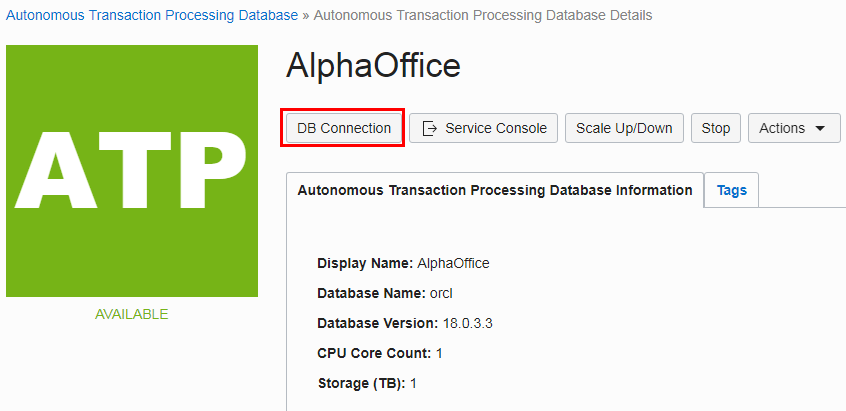

  - Click **Download**

	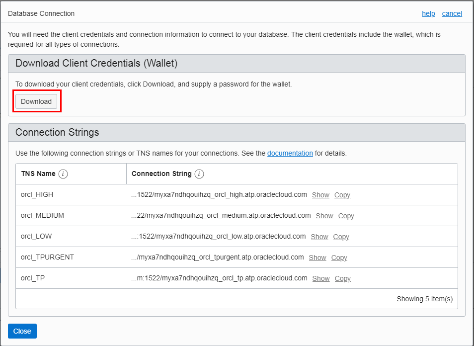

  - Enter the **Password** `a1phaOffice1_` and click **Download**

	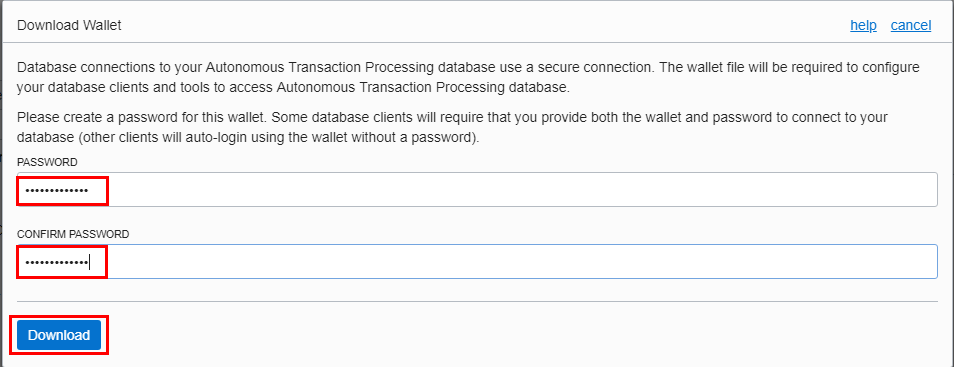

  - Select `Save File` and Click **OK**

	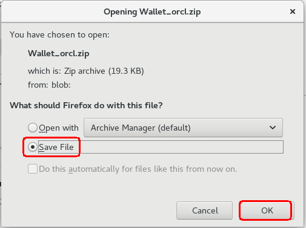

  - The **Wallet_orcl.zip** file was Downloaded to the directory `/home/opc/Downloads/`

	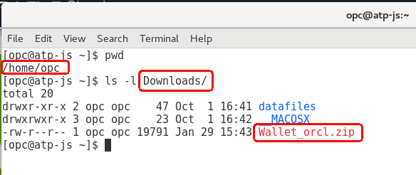

  - As information, the ATP Wallet file **Wallet_orcl.zip** contains the following files

	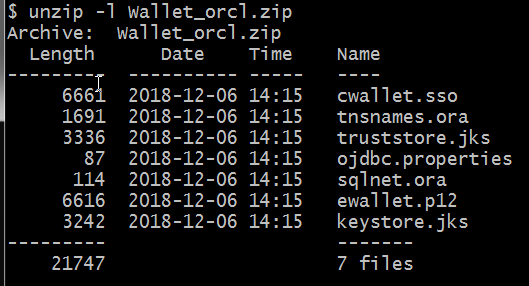

### **STEP 8**: Create SQL Developer Connection to ATP Database

  - Open **SQL Developer** available on the client image by double-clicking on the Desktop Icon

	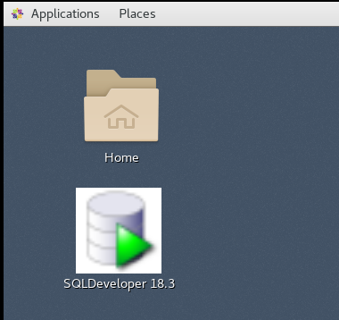  

  - In the **Connections** Pane, Click 

	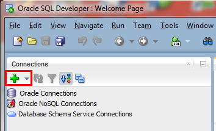

  - Enter/Select the following values, click **Test**. After a `Success` **Status**, click **Save**, then **Connect**

	- **Connection Name:**  ```atp-AlphaOffice-Admin```
	- **Username:**  ```admin```
	- **Password:**  ```a1phaOffice1_```
	- Select ```Save Password```
	- **Connection Type:**  ```Cloud Wallet```
	- **Configuration File:**  The ```Wallet_orcl.zip``` you downloaded in the previous step

	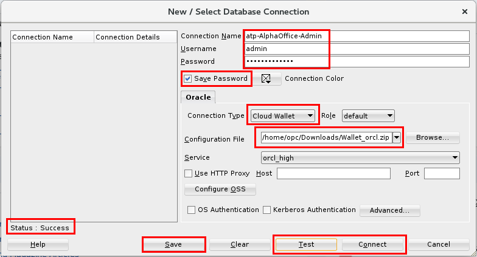

### **STEP 9**: Create Database User in ATP Database

  - In the **SQL Developer Worksheet**, execute the following SQL Statements to create the `alpha` database user.

	```
	create user alpha identified by "a1phaOffice1_";
	grant dwrole to alpha;
	```

	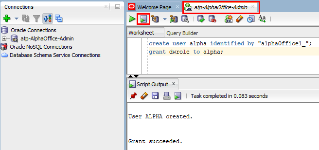

### **STEP 10**: Create DBMS_CLOUD Credential

  - In the same **SQL Developer Worksheet**, execute the following SQL Statements to create the **DBMS_CLOUD Credential** `impdp_OBJ_STORE`.

	```
	begin
	  DBMS_CLOUD.create_credential(
		credential_name => 'impdp_OBJ_STORE',
		username => 'impdp-ATP',
		password => 'Auth Token Generated in STEP 6'
	  );
	end;
	/
	```

	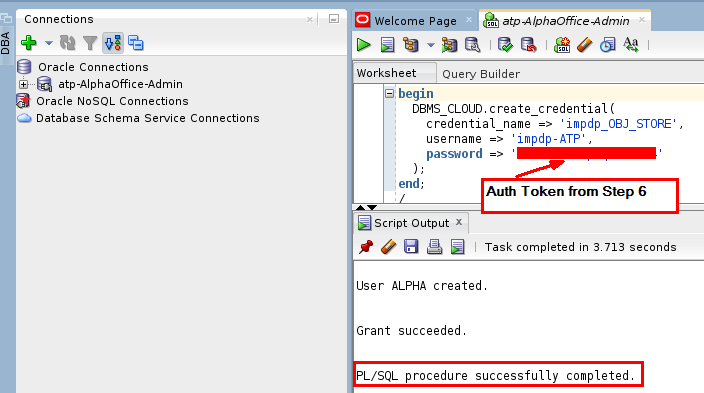

# Import Data Pump Export file into ATP Databse and Download/Inspect Data Pump Log File

### **STEP 11**: Add DBA View and ATP SQL Developer Connection

  - In **SQL Developer**, click on the menu **View** and select **DBA**

	

  - You will now see the **DBA** pane in the lower, left side of **SQL Developer**

	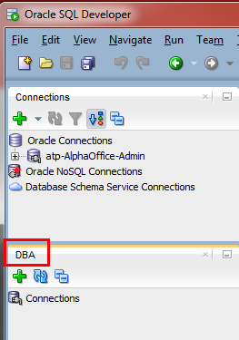

  - Next, you will add the **Connection** you created in STEP 8 to the **DBA** pane. Click  below **DBA**, select the Connection `atp-AlphaOffice-Admin` and click **OK**

	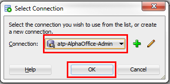

  - Now you will see the connection in the **DBA** pane.

	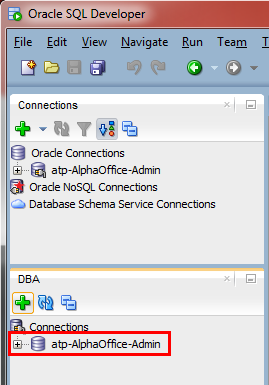

### **STEP 12**: Import Data into ATP Instance using Data Pump Import Wizard

  - Expand the `atp-AlphaOffice-Admin` connection under the **DBA** pane until the **Data Pump** section is expanded.

	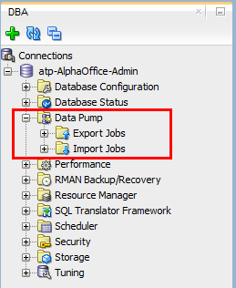

  - Right-click on **Import Jobs** and select **Data Pump Import Wizard...**

	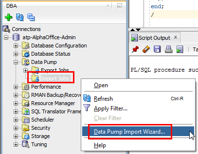

  - On **Step 1** of the **Import Wizard**, select and/or enter the following and click **Next**

	- **Type of Import:** ```Full```
	- **Credentials or Directories:** ```IMPDP_OBJ_STORE``` (Created in STEP 10)
	- **File Names or URI:** ```https://swiftobjectstorage.{REGION}.oraclecloud.com/v1/{OBJECT_STORAGE_NAMESPACE}/{BUCKET}/{FILENAME}```

	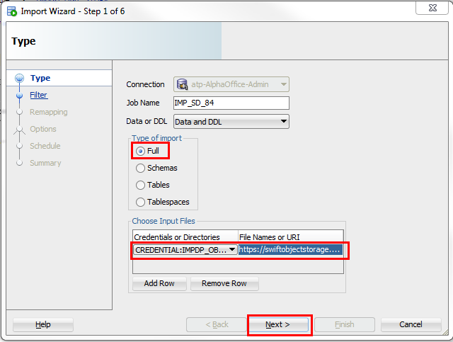

	**Note:** For example, the **Swift URI** for the Data Pump DMP file uploaded to Object Storage in STEP 4 would be

	```
	https://swiftobjectstorage.us-ashburn-1.oraclecloud.com/v1/{OBJECT_STORAGE_NAMESPACE}/atpData/expdp_alpha121.dmp
	```

	**Note:** To determine the values for **REGION, BUCKET, OBJECT_STORAGE_NAMESPACE, FILENAME** to complete the **Swift URI**, navigate to **Object Storage** and click on the `atpData` **Bucket**

	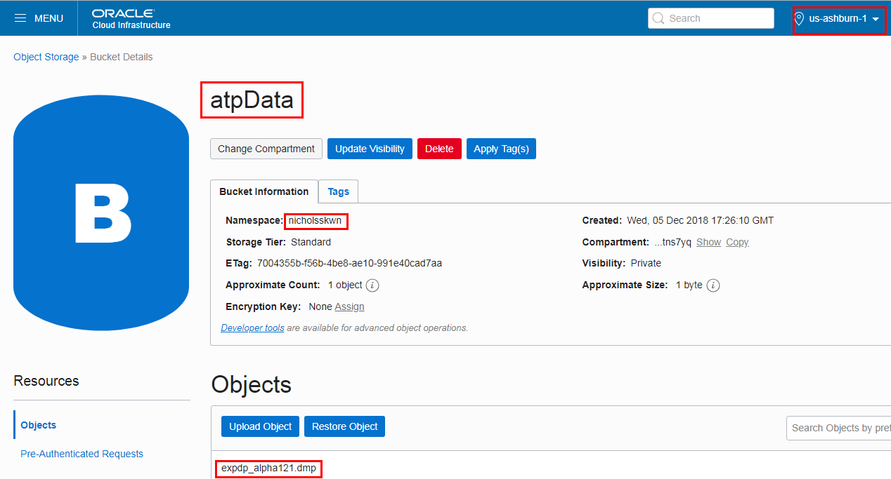

  - Accept the Defaults and click **Next** on **Step 2** of the **Import Wizard**. It can take 30 seconds for the **Next** button to be enabled.

	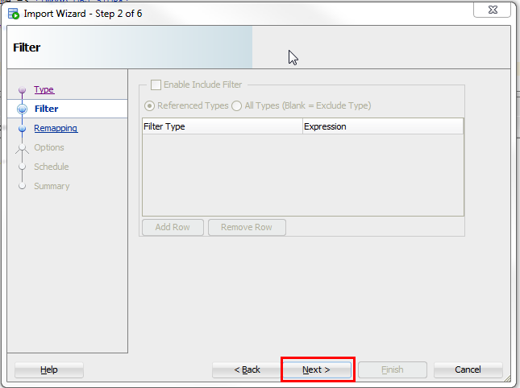

  - Accept the Defaults and click **Next** on **Step 3** of the **Import Wizard**.

	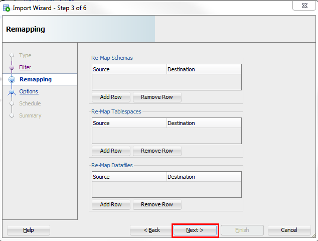

  - Accept the Defaults and click **Next** on **Step 4** of the **Import Wizard**.

	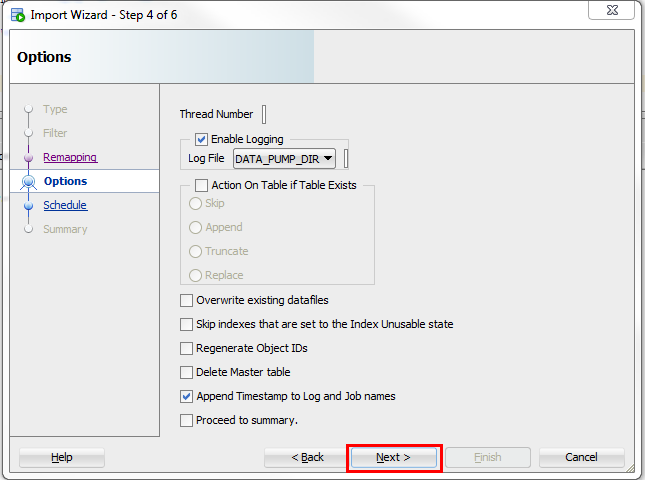

  - Accept the Defaults and click **Next** on **Step 5** of the **Import Wizard**.

	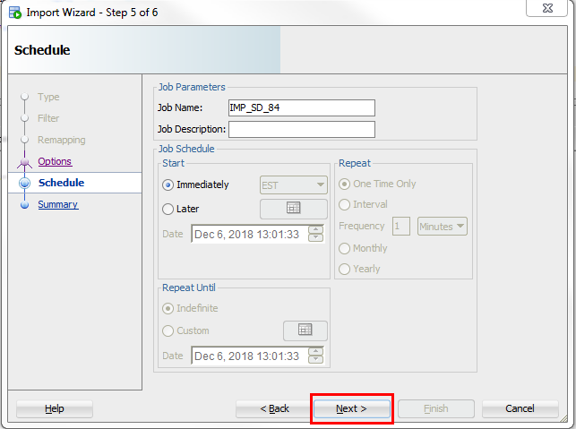

  - Review the **Summary** and click **Finish** on **Step 6** of the **Import Wizard**.

	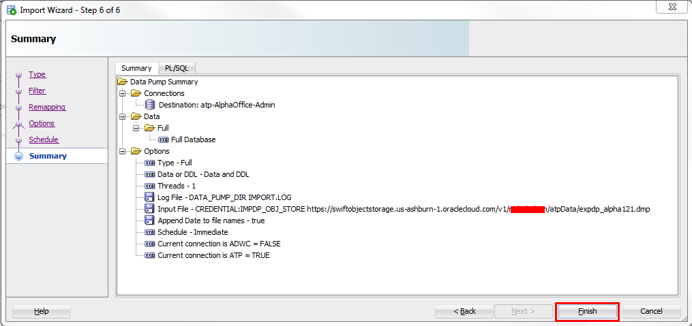

	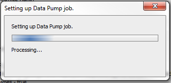

  - Once the **Setting up Data Pump job** window closes, click on the **Import Job** to monitor the **State** of the Import. The state will transition from `EXECUTING` to a state of `COMPLETING` to a final state of `NOT RUNNING`. Be sure to click the Refresh icon  to get the latest **State**.

	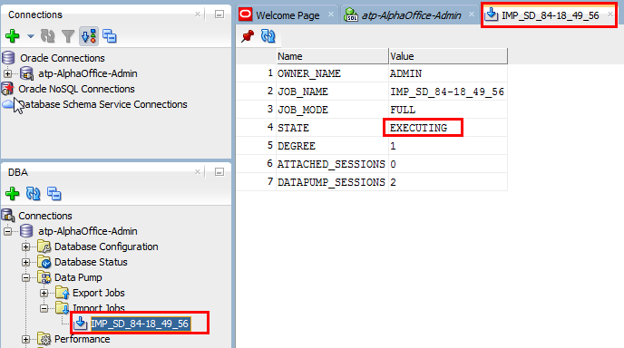

  - To verify the **Data Pump** import job created and loaded the tables, run the following SQL statement

	```
	select table_name, num_rows from all_tables where owner = 'ALPHA' order by 1;
	```

	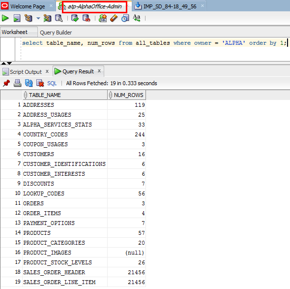

### **STEP 13**: Review Data Pump Import Log

The **DBMS_CLOUD** package provides the **LIST_FILES** and **PUT_OBJECTS** subprogams which allow you to interact with an **Autonomous Transaction Processing Database**

  - To view what files are in the Data Pump directory `DATA_PUMP_DIR`, issue the following command in **SQL Developer**.

	```
	SELECT * FROM DBMS_CLOUD.LIST_FILES('DATA_PUMP_DIR');
	```

	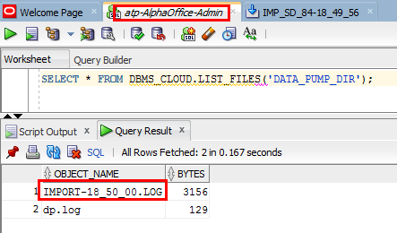

  - To view the **Data Pump** import log file `IMPORT-18_50_00.LOG` just created by the **Import Job** executed in the previous step, we leverage the **PUT_OBJECTS** subprogram to copy the file from the ATP database to an **Object Storage Bucket** where we can download and review it. Execute the following command in **SQL Developer**

	```
	BEGIN
	  DBMS_CLOUD.PUT_OBJECT(
		credential_name => 'impdp_OBJ_STORE',
		object_uri => 'https://swiftobjectstorage.us-ashburn-1.oraclecloud.com/v1/{OBJECT_STORAGE_NAMESPACE}/atpData/impdp_alpha121_sqldev.log',
		directory_name  => 'DATA_PUMP_DIR',
		file_name => 'IMPORT-18_50_00.LOG');
	END;
	/
	```

	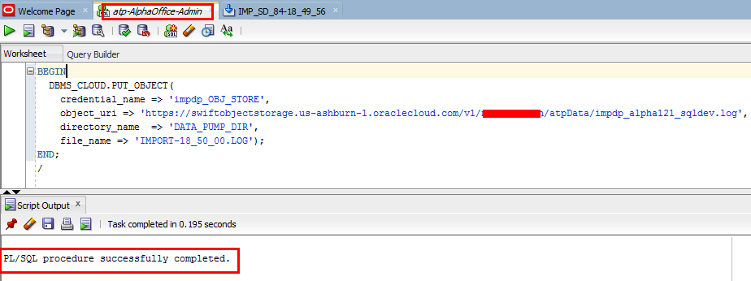

  - If you navigate to **Object Storage Bucket** `atpData`, you will now see the file `impdp_alpha121_sqldev.log` file. Click  to the right of the object name and select **Download**.

	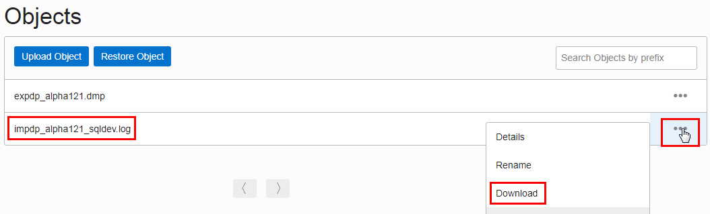

  - Once downloaded, open it using a text editor to review the import messages. You will notice the **Import Job Name** `IMP_SD_84-18_49_56` in **SQL Developer** is also referenced in the log file.

	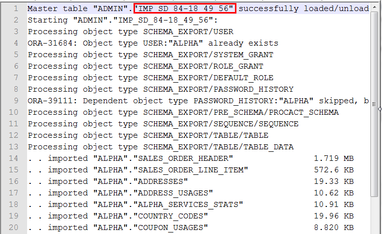

**This completes the Lab!**

**You are ready to proceed to [Lab 200](LabGuide200.md)**
