# Monolithic to Microservice Cloud Native Development - Kubernetes REST Service Deployment

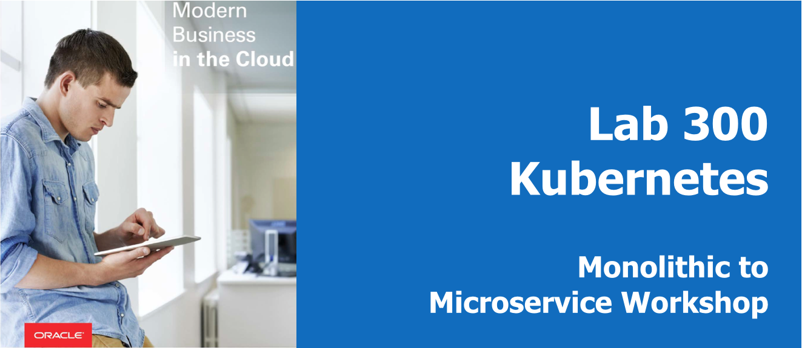

## Introduction

Thus far on our journey from a monolithic application to microservices, we have created our supporting infrastructure, populated our database, and packaged our Java application as a Docker container. Now we need to deploy that Docker image somewhere that it will be accessible to our customers, as well as be manageable, observable, and scalable -- a Kubernetes cluster.

During this lab, you will take the Docker image that you created in Lab 200 and store it in a Docker registry in OCI. You will create a managed Kubernetes cluster in OCI and deploy the application to the cluster from the Docker registry.

**_To log issues_**, click here to go to the [github oracle](https://github.com/oracle/learning-library/issues/new) repository issue submission form.

## Objectives

- Provision a Kubernetes cluster on OCI (OKE)
- Store Docker image in OCI Repository (OCIR)
- Deploy application to Kubernetes cluster
- Validate application deployment

## Required Artifacts

- You should already have completed labs 50, 100, and 200 before beginning this lab.

## Provision a Kubernetes Cluster on OCI (OKE)

### **STEP 1**: Prerequisite: Add a Policy Statement for OKE

- You should already have a browser tab logged in to the OCI Console. If you do not, log in again:

    [https://cloud.oracle.com/en_US/sign-in](https://cloud.oracle.com/en_US/sign-in)

- Before the Oracle managed Kubernetes service can create compute instances in your OCI tenancy, we must explicitly give it permission to do so using a policy statement. From the OCI Console navigation menu, choose **Identity->Policies**.

  

- In the Compartment drop down menu on the left side, choose the **root compartment**. It will have the same name as your OCI tenancy (Cloud Account Name).

  

- Click **PSM-root-policy**

  

- Click the **Add Policy Statement** button

  

- In the Statement box, enter: `allow service OKE to manage all-resources in tenancy` and click **Add Statement**

  

### **STEP 2**: Provision Kubernetes Using the OCI Console

- Now we're ready to create our Kubernetes cluster. From the OCI Console navigation menu, select **Developer Services->Container Clusters (OKE)**.

  

- In the Compartments drop down, select the **monoTomicro** compartment.

  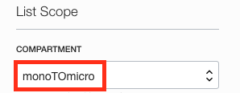

- Click **Create Cluster**

  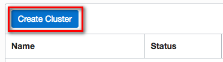

- We don't need to make any changes to the default values on this form, but let's look at what will be created when we submit it.

  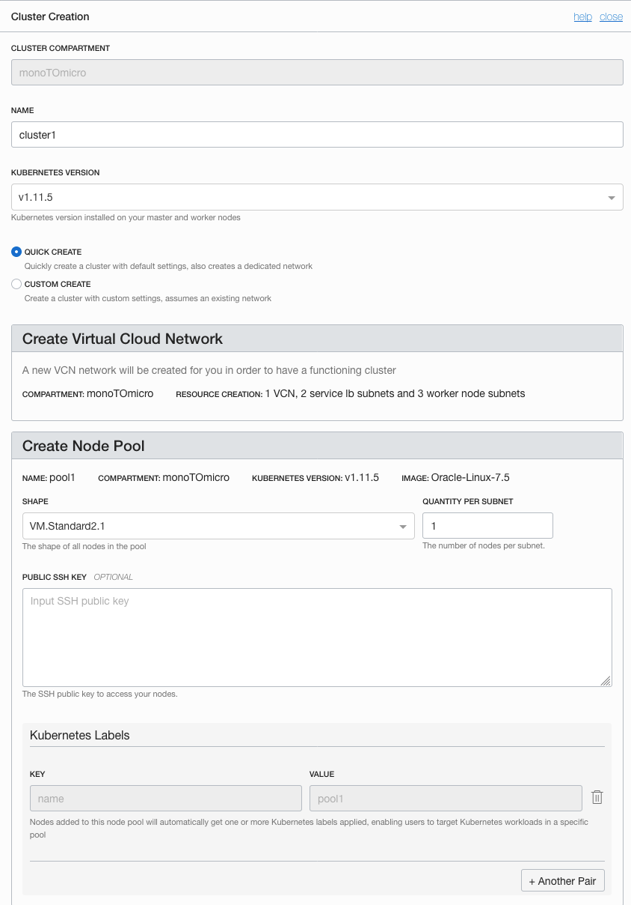
  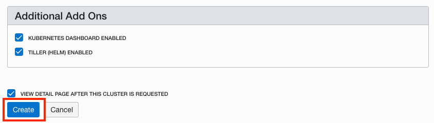

  - Starting at the top you'll notice that the cluster will be created in our **monoTomicro** compartment.
  - We can customize the name of this cluster if we want
  - Multiple versions of Kubernetes are available, with the newest version selected by default
  - The default cluster creation mode will automatically create a Virtual Cloud Network for our cluster, including 2 load balancer subnets and 3 subnets for our worker VMs
  - We can customize the size and quantity of worker VMs in the node pool; by default we will get 3x 1 OCPU VMs, one in each Availability Domain.
  - We can also add more node pools to the cluster after creation.
  - The dashboard and Tiller will be installed by default.

- Click **Create**. You will be brought to the cluster detail page. Your cluster will take a while to provision, so let's use this time to set up the OCI CLI and Kubernetes CLI that we will use to interact with our cluster.

### **STEP 3**: Install and Configure OCI CLI on your OCI VM

- You should still have an SSH session connected to the OCI VM where you installed Docker in the previous lab. If you have closed it, reopen it using either PuTTY or `ssh` from the command line, as you did in the previous lab.

- From _inside the SSH session_, run the following command to install the OCI CLI, which will allow you to interact with your cluster:

  `bash -c "$(curl -L https://raw.githubusercontent.com/oracle/oci-cli/master/scripts/install/install.sh)"`

  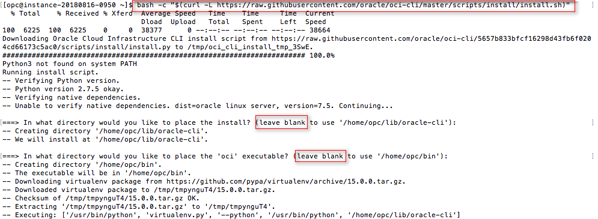

- For each of the prompts, accept the default by **pressing enter**

  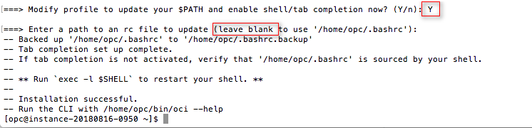

- When the install is finished, configure the OCI CLI by running `oci setup config` in your SSH session. In a web browser on your local machine, open your **User Settings** page: use the navigation menu to go to Identity->Users and select **View User Details** from the three-dots menu for your user. You will need some details from this page to complete the setup.

  

- After initiating `oci setup config`, respond to the prompts as follows:
  - Enter a location for your config: **accept default by pressing enter**
  - Enter a user OCID: copy your OCID by clicking **Copy** in the **User Information** box in OCI Console
  - Enter a tenancy OCID: copy the **Tenancy OCID** from the tenancy details page (found under the administration section of the OCI navigation menu)

    

    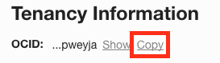

  - Enter a region: type the **region shown in the upper right** corner of OCI Console
  - Do you want to generate a new RSA key pair?: **Y**
  - Enter a directory for your keys to be created: **accept default by pressing enter**
  - Enter a name for your key: **accept default by pressing enter**
  - Enter a passphrase for your private key: **accept default by pressing enter**

  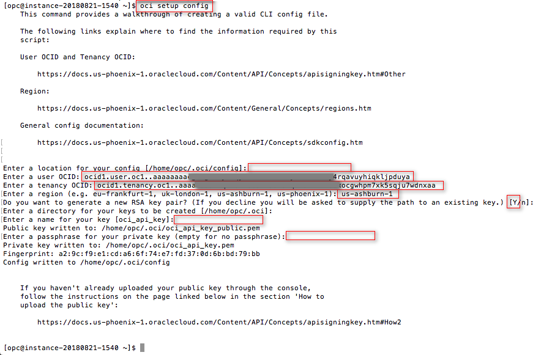

- You've just generated an RSA key pair that we will use to authenticate you to the OCI API. Click **back** to get back to the User Settings page in your browser, click **Add Public Key**

  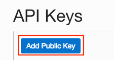

- We need to copy and paste the public key into this box. In your _SSH session_, run the following command to output the public key:

  `cat /home/opc/.oci/oci_api_key_public.pem`

  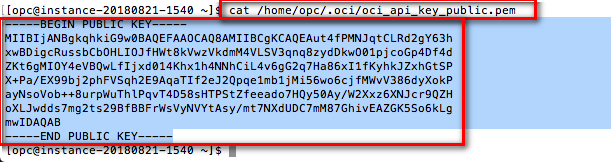

- Select the entire key, beginning with: `-----BEGIN PUBLIC KEY-----` and ending with `-----END PUBLIC KEY-----`. **Copy it** and **paste it** into the Public Key text area in the OCI Console Add Public Key dialog. Then click **Add**.

  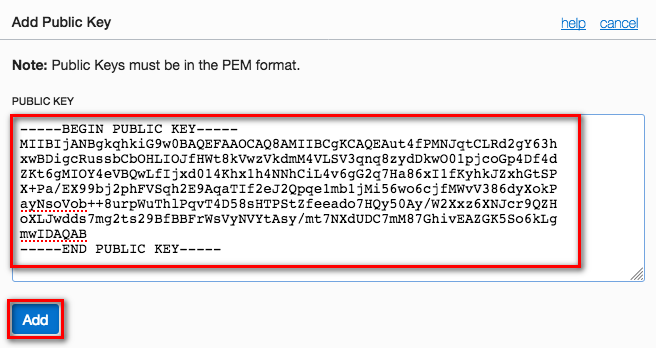

- You are now ready to download the `kubeconfig` file using the OCI CLI that you just installed. From the OCI Console navigation menu, select **Developer Services->Container Clusters (OKE)**, then click the name of your cluster, **cluster1**

  

  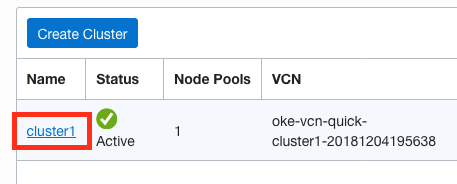

- Click **Access Kubeconfig**.

  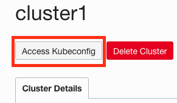

- Two commands are displayed in the dialog box. **Copy and paste** each command (one at a time) into your _SSH session_ and run them. The first creates a directory to store the `kubeconfig` file, and the second invokes the OCI CLI to download and store the `kubeconfig` file on your client virtual machine. Then click **Close**.

  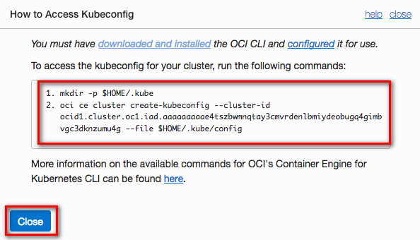

  

  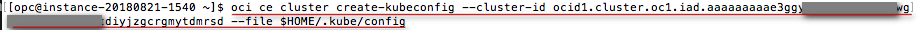

  **NOTE**: Copy and paste the commands from the OCI Console window -- the second command below is personalized with your cluster OCID. They are listed here for reference only.

  >mkdir -p $HOME/.kube

  >oci ce cluster create-kubeconfig --cluster-id <your-kubernetes-cluster-ocid\> --file $HOME/.kube/config

- Your `kubeconfig` file was downloaded from OCI and stored in ~/.kube/config. In your _SSH session_, **run** `cat ~/.kube/config` to output the contents of the file. **Copy** the contents and **paste** them into a new text file on your local machine. Name the file `kubeconfig` and **Save** the file wherever you'd like on your local machine.

  **NOTE**: Save the `kubeconfig` file as a plain text file, not as a .docx, .rtf, .html, etc.

  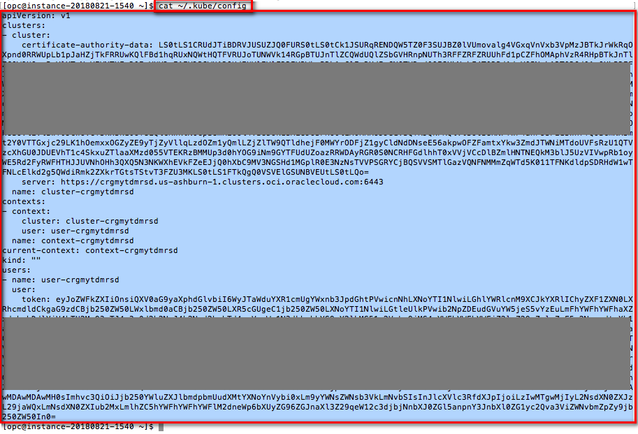

- While we are still connected to our OCI VM, let's push our Docker image that we created in the previous lab to our Docker registry on OCI (OCIR).

## Store Docker image in OCI Repository (OCIR)

### **STEP 4**: Push Docker Image from your OCI VM to OCI Registry

- In order to push our function Docker image into our OCI Registry, we will need to log in using the Docker CLI. The password we use to authenticate is an **OCI Auth Token**, just as we created for Wercker in Lab 200. Navigate to the **OCI Console** in a web browser on your local machine. Open your **User Settings** page by using the navigation menu to go to Identity->Users and select **View User Details** from the three-dots menu for your user.

  

- In the Resources menu of the user settings page, click **Auth Tokens**. Then click **Generate Token**.

  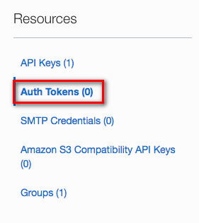

  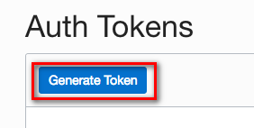

- In the Description field, enter **Docker** and click **Generate Token**.

  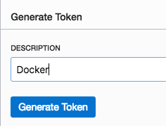

- The token is displayed in the dialog box. Leave it open, you will copy it in the next instruction.

    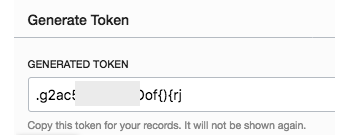

- In your _SSH session_, run the following command, **substituting your OCI tenancy name and your Oracle Cloud username (probably your email address)** for `<your-tenancy-name> and <your-oracle-cloud-username>`, and  **replacing `iad` with your OCI region** :

  ```bash
  docker login -u <your-tenancy-name>/<your-oracle-cloud-username> iad.ocir.io
  ```

  **NOTE**: If you are not currently using the Ashburn OCI region, replace `iad` in the preceding URL with the correct abbreviation for your OCI region:

  ```
  London = lhr
  Frankfurt = fra
  Phoenix = phx
  Ashburn = iad
  Toronto = yyz
  ```

- You will be prompted for your registry password. Click the **Copy** link from the OCI Console browser window displaying your newly-generated Auth Token. Then **paste** the token into the password prompt in your SSH session and press enter.

  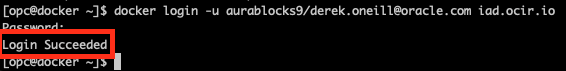

- Now that you are logged in, we can push the Docker image of the Alpha Office microservice to the registry. Just use the standard **docker push** command, no need to pre-create the repository in OCIR:

```bash
docker tag alphaoffice-rest iad.ocir.io/<your-tenancy-name>/alphaoffice-rest:v1
docker push iad.ocir.io/<your-tenancy-name>/alphaoffice-rest:v1
```

**NOTE**: If you are not currently using the Ashburn OCI region, replace `iad` in the preceding URLs with the correct abbreviation for your OCI region, as you did for the `docker login` step above.

  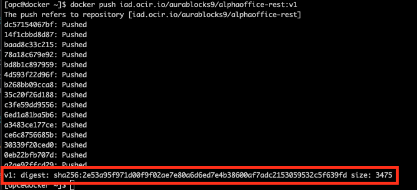

- The push looked successful, but let's verify it in the OCI Console. Open the **OCI Console** website in a browser _on your local machine_. From the Developer Services section of the navigation menu, choose **Registry (OCIR)**

  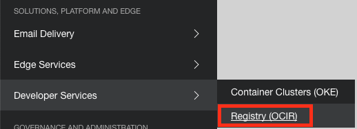

- Click on the **triangle** to expand the **alphaoffice-rest** repository, then click **v1**. Looks like our push was indeed successful, and here in the console we can see some metadata about our Docker image, such as the last updated date and image size.

  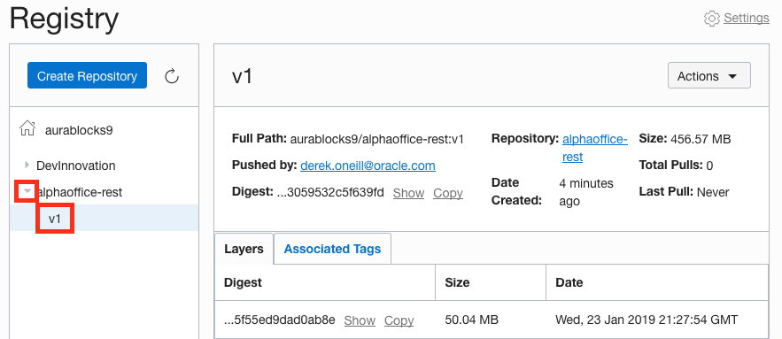

- From the Actions menu, click **Copy Pull Command**. Then, **paste** this command in a text file or note, where you can retrieve it later. We will use the URL for this image when we create our application specification in Kubernetes.

  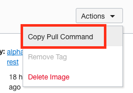

- Now let's make our repository public, so that we can pull it from our Kubernetes cluster without needing to log in to OCIR. Click the name of the repository in the list on the left, **alphaoffice-rest**.

  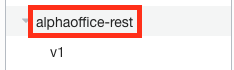

- From the Actions drop down, click **Change to Public**

  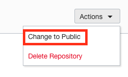

- Now that our Docker image is stored in a container registry, we can deploy it to our Kubernetes cluster.

## Deploy application to Kubernetes cluster

### **STEP 5**: Install kubectl

- In order to interact with your cluster and view the dashboard, you will need to install the Kubernetes command line interface, `kubectl`. We will do that now.

- The method you choose to install `kubectl` will depend on your operating system and any package managers that you may already use. The generic method of installation, downloading the binary file using `curl`, is given below (**run the appropriate command in a terminal or command prompt**). If you prefer to use a package manager such as apt-get, yum, homebrew, chocolatey, etc, please find the specific command in the [Kubernetes Documentation](https://kubernetes.io/docs/tasks/tools/install-kubectl/).


  **Windows**
    ```bash
    curl -LO https://storage.googleapis.com/kubernetes-release/release/v1.11.2/bin/windows/amd64/kubectl.exe
    ```

  **Mac**
    ```bash
    curl -LO https://storage.googleapis.com/kubernetes-release/release/$(curl -s https://storage.googleapis.com/kubernetes-release/release/stable.txt)/bin/darwin/amd64/kubectl
    chmod +x ./kubectl
    ```

  **Linux**
    ```bash
    curl -LO https://storage.googleapis.com/kubernetes-release/release/$(curl -s https://storage.googleapis.com/kubernetes-release/release/stable.txt)/bin/linux/amd64/kubectl
    chmod +x ./kubectl
    ```

- In your terminal window or command prompt, run the following commands to verify that `kubectl` is able to communicate with your cluster. You should see `cluster-info` print out the URL of the Kubernetes Master node and `get nodes` print out the IP address and status of each of the worker nodes.

  **Windows**
    ```bash
    set KUBECONFIG=.\kubeconfig
    kubectl.exe cluster-info
    kubectl.exe get nodes
    ```

  **Mac/Linux**
    ```bash
    export KUBECONFIG=`pwd`/kubeconfig
    ./kubectl cluster-info
    ./kubectl get nodes
    ```

### **STEP 6**: Deploy application using Kubernetes dashboard

- We can use `kubectl` to start a proxy that will give us access to the Kubernetes Dashboard through a web browser at a localhost URL. Run the following command in the same terminal window:

  **Windows**
    ```bash
    kubectl.exe proxy
    ```

  **Mac/Linux**
    ```bash
    ./kubectl proxy
    ```

- Leave the proxy server running and navigate to the [Kubernetes Dashboard by Right Clicking on this link](http://localhost:8001/api/v1/namespaces/kube-system/services/https:kubernetes-dashboard:/proxy/), and choosing **open in a new browser tab**.

- You are asked to authenticate to view the dashboard. Click **Choose kubeconfig file** and select the `kubeconfig` file you created earlier. Click **Open**, then click **Sign In**.

  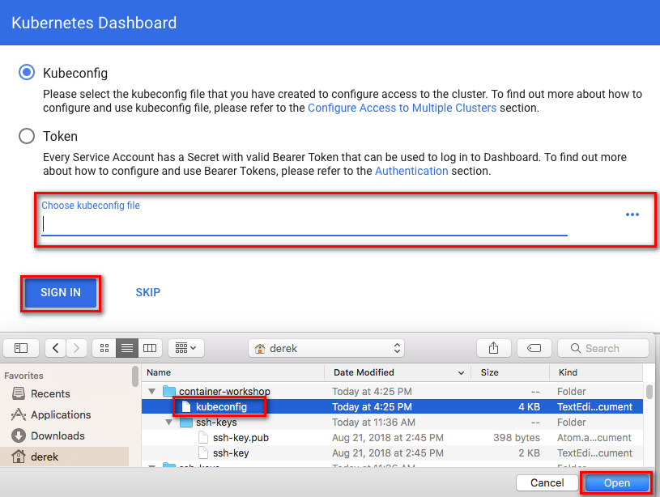

- After authenticating, you are presented with the Kubernetes dashboard.

  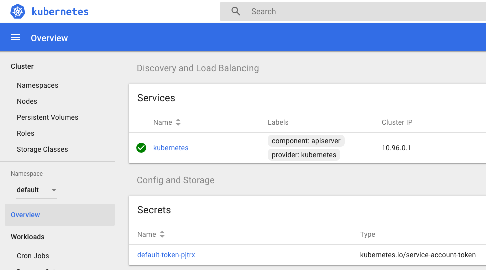

- Great! We've got Kubernetes installed and accessible -- now we're ready to get our microservice deployed to the cluster. There are several methods of deploying applications to Kubernetes, including using the `kubectl` CLI, using an automation tool such as Jenkins or Oracle Container Pipelines, or using the dashboard GUI. For this lab, we'll use the Dashboard GUI wizard. In the upper right corner of the Kubernetes Dashboard, click **Create**.

  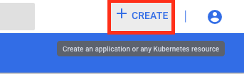

- We'll build our app using the wizard rather than a pre-written yaml file, so click **Create An App**

  

- Fill out the form with the following values:

  - App name: **alphaoffice-rest** (this name can be anything we want, and will be used to address our application from other services inside the cluster)
  - Container image: **iad.ocir.io/<your-tenancy-name\>/alphaoffice-rest:v1** (retrieve this URL from the `docker pull` command that you that you saved in the previous step. Do not include the `docker pull` portion, just the URL at the end, which is the location of our image in OCIR)
  - Number of Pods: **1** (this can be customized)
  - Service: **External** (this will create a load balancer for our service)
  - Port: **80** (this is the port that will be exposed by the load balancer)
  - Target Port: **8080** (this is the port that our application is listening on inside its container.)

- Once the form is filled out, click **Deploy**.

  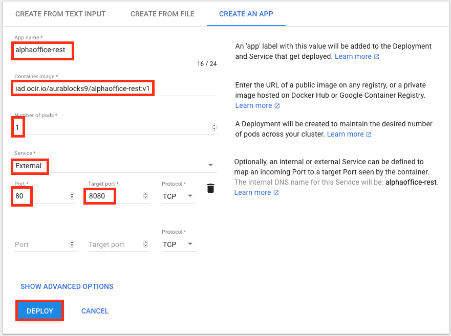

- The wizard will create a **Deployment** and a **Service** that make up your application. You will see the status of both on the dashboard overview page:

  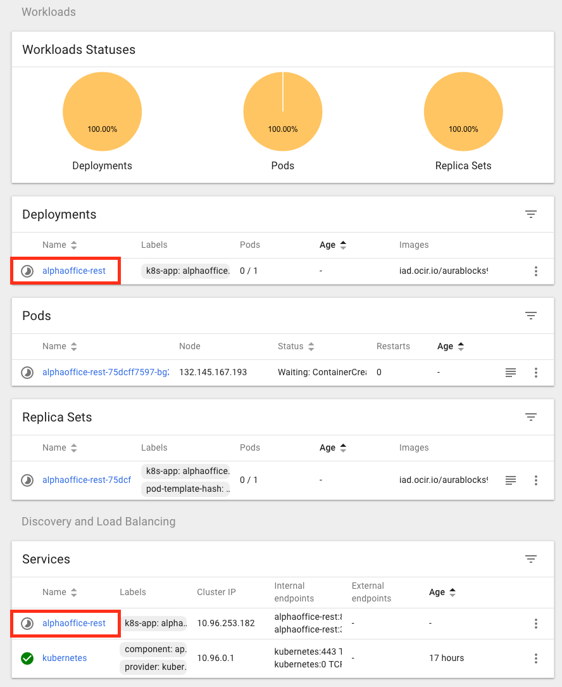

  - The **deployment** represents the running containers that execute your application. Child objects including replica sets and pods are created by the deployment to satisfy the desired number of running instances you specified.
  - The **service** represents the exposure of your application on the network, in this case to the internet via an OCI load balancer. It will take a couple of minutes to provision the load balancer, and once it is finished you will see an external endpoint link populated with its IP address.

- Refresh the dashboard overview page (it does not automatically update) to see the **External endpoint** of your load balancer. **Click the link** to open it in a new tab.

  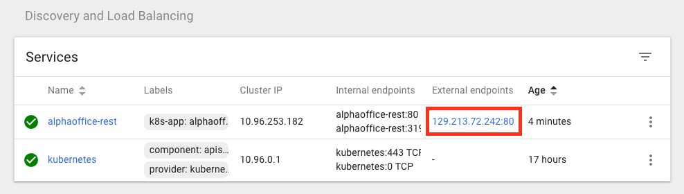

- You should see the Glassfish welcome page. That means we are successfully talking to our application server inside of the running container on our Kubernetes cluster, through the load balancer that exposes it to the internet.

  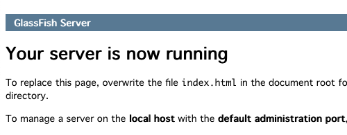

## Validate application deployment

### **STEP 7**: Test REST service in a web browser

- Now let's test out the REST service in that container that is pulling our product catalog data from the Autonomous Transaction Processing database in OCI. At the end of the URL in the address bar (which should be just the IP address of your load balancer), paste the following path and press **enter**

  ```
  /AlphaProductsRestService/webresources/restCall/
  ```

  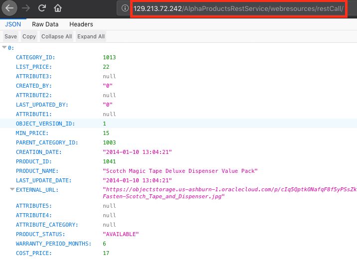

- You should see JSON data returned from the REST service, meaning we've successfully deployed our microservice to the Kubernetes cluster. We could stop here, but let's explore one more way to interact with our running containers inside the cluster.

### **STEP 8**: Test REST service using the command line

- In your terminal window that is running the `kubectl proxy` command, press **Control-C** to stop the proxy.

  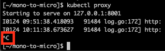

- Run this command to get a list of the running pods in your cluster. You will need the full name of the alphaoffice-rest pod, including the string of numbers and letters at the end, in the next step.

  **Windows**
  ```bash
  kubectl.exe get pods
  ```

  **Mac/Linux**
  ```bash
  ./kubectl get pods
  ```

  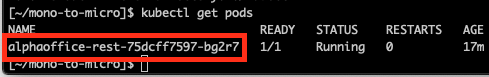

- Run the following to execute bash commands directly inside your container. Note that we address the container using its own hostname, not the IP address of the load balancer. Replace **<full-name-of-your-pod-from-previous-step\>** with the name of the alphaoffice-rest pod, including the trailing numbers and letters.

  **Windows**
  ```bash
  kubectl.exe exec -it <full-name-of-your-pod-from-previous-step> -- /bin/sh -c "curl $HOSTNAME:8080/AlphaProductsRestService/webresources/restCall/1050"
  ```

  **Mac/Linux**
  ```bash
  ./kubectl exec -it <full-name-of-your-pod-from-previous-step> -- /bin/sh -c 'curl $HOSTNAME:8080/AlphaProductsRestService/webresources/restCall/1050'
  ```

  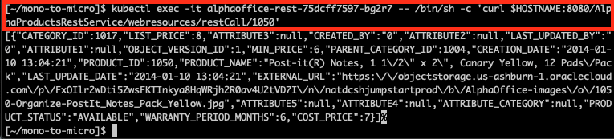

- Once again you should see JSON data returned. This method of executing commands inside running containers is great for debugging. Often, you will have running containers that do not have a load balancer in front of them (because they are only accessed by other services in the cluster, not end users), and being able to run commands inside of them can help you diagnose issues.

- Now that our REST service is deployed to Kubernetes, let's build a user interface on top of it so that end users can consume our product catalog.

  [**Proceed to Lab 400**](LabGuide400.md)
