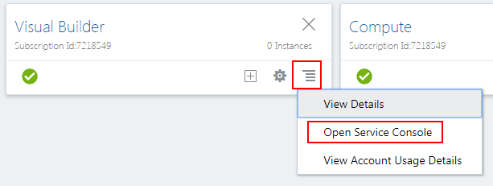
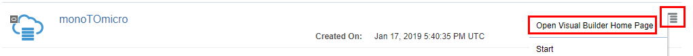
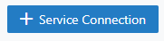

# Monolithic to Microservice Cloud Native Development - Low Code, Microservice Mobile Development

  

## Introduction

In this lab you will use Oracle Visual Builder which is a cloud-based software development Platform as a Service (PaaS) and a hosted environment for your application development infrastructure. It provides an open-source standards-based solution to develop, collaborate on, and deploy applications within Oracle Cloud.

**_To log issues_**, click here to go to the [github oracle](https://github.com/oracle/learning-library/issues/new) repository issue submission form.

## Objectives

- Create a Mobile Application
- Access the REST services you deployed in Lab 300 on OKE
- Deploy the mobile application to your phone (Android based)

## Required Artifacts

- Lab 300 needs to be completed with the AlphaOffice REST application deployed

# Login in and Create the Application

## Verify the VBCS Instance

### **STEP 1**: Check the creation of the instance from Lab 050

- From the Dashboard **click the hamburger menu** in the Visual Builder Cloud Service pane, **right-click on Open Service Console** and select **Open link in new tab**.

  

- From the Instances tab you should see the monoTOmicro instance you created in Lab 050. Drilling down in the **Instance Create and Delete History** should show a successfull creatation status:

  

  

- **Click the hamburger menu** of the instance and select **Open Visual Builder Home Page**.

  

- On the Welcome page click **+ New Applcation**.

  

- In the Create Application dialog enter:

  ```
  Product Catalog
  ```

  ... and click **Finish**.

  

- An initial page will show. Now you will begin to create the components used in the application.

  

### **STEP 2**: Create Service Connections

Service Connections are REST endpoints pointing to various services. In this step you will reference REST endpoints from the application deployment you created in Lab 300. We will create endpoints for GET, GET/{id}, POST, PUT and DELETE/{id}.

- If not already opened click on the **Navigator icon** near the upper left hand side of the web page. This will expand the pane. You can click the **X** on the Welcome tab to close it. Finally, click on the **Service Connections** icon.

  

- Click **+ Service Connection** and then click **Define by Endpoint**. 

  

  

- Leave the Method to **GET**. From Lab 300 **Copy and Paste the URL** used to test the REST endpoint that retrieved all of the AlphaOffice Product Catalog records. (In this example:  `http://129.213.109.189:8080/AlphaProductsRestService/webresources/restCall`) into the URL field. Leave the Action Hint at **Get Many**:

  

- Click **Next**.

- Select the **Test** tab and click **Send**. The request should return all of the records (shown in the Response). If successful, click the **Copy to Reponse Body** button.

  

- Click **Create**.

  

- Click the **Endpoints** tab to see the created GET. Click **+ Endpoint** to add another.

  

- Create another **GET** method with the PATH having a **suffix** of **restCall/{id}**. Set the Action Hint dropdown to **Get One**.

  

- Click the **Test** tab. For the URL Parameter enter **1027**. Click **Send**. One record is returned with the PRODUCT_ID of `1027`. If successfull, Click the **Copy to Reponse Body** button.

  

- Click **Add**.

  

- Click the **Endpoints** tab to see the created methods thus far.

- This time we will be creating a POST method which inserts a record into the database. Create a **POST** method with the PATH having a **suffix** of **restCall**. Set the Action Hint dropdown to **Create**.

  

- Click the **Test** tab. **Copy and Paste** the following payload into the **Request Body** section:

  ```
  {
    "LIST_PRICE": 11.99,
    "PRODUCT_ID": null,
    "PRODUCT_NAME": "Dry Erase Test Markers"
  }
  ```

  

- Click the **Copy to Request Body** button.

- Click **Send**. If successfull you should see a return message `"Successfully Saved."`. The PRODUCT_ID is null because a database trigger will automatically create an ID. 

- Since the returned payload is plain text we will set the Response body as such. Click the **Response** tab. Click the **Pencil icon** in the Media Type dropdown and add:

  ```
  plain/text
  ```

 

- Click **Done** and then click **Add** to complete the POST definition.
 
  


### **STEP 1**: Check the creation of the instance from Lab 050

- From the Dashboard 

  

### **STEP 1**: Check the creation of the instance from Lab 050

- From the Dashboard 

  

### **STEP 1**: Check the creation of the instance from Lab 050

- From the Dashboard 

  

### **STEP 1**: Check the creation of the instance from Lab 050

- From the Dashboard 

  
  
  ### **STEP 1**: Check the creation of the instance from Lab 050

- From the Dashboard 

  

### **STEP 1**: Check the creation of the instance from Lab 050

- From the Dashboard 

  
  
  ### **STEP 1**: Check the creation of the instance from Lab 050

- From the Dashboard 

  

### **STEP 1**: Check the creation of the instance from Lab 050

- From the Dashboard 

  
  
  ### **STEP 1**: Check the creation of the instance from Lab 050

- From the Dashboard 

  

### **STEP 1**: Check the creation of the instance from Lab 050

- From the Dashboard 

  
  
  ### **STEP 1**: Check the creation of the instance from Lab 050

- From the Dashboard 

  

### **STEP 1**: Check the creation of the instance from Lab 050

- From the Dashboard 

  
  
  ### **STEP 1**: Check the creation of the instance from Lab 050

- From the Dashboard 

  

### **STEP 1**: Check the creation of the instance from Lab 050

- From the Dashboard 

  
  
  ### **STEP 1**: Check the creation of the instance from Lab 050

- From the Dashboard 

  

### **STEP 1**: Check the creation of the instance from Lab 050

- From the Dashboard 

  
  
  ### **STEP 1**: Check the creation of the instance from Lab 050

- From the Dashboard 

  

### **STEP 1**: Check the creation of the instance from Lab 050

- From the Dashboard 

  
  
  ### **STEP 1**: Check the creation of the instance from Lab 050

- From the Dashboard 

  

### **STEP 1**: Check the creation of the instance from Lab 050

- From the Dashboard 

  
  
  ### **STEP 1**: Check the creation of the instance from Lab 050

- From the Dashboard 

  

### **STEP 1**: Check the creation of the instance from Lab 050

- From the Dashboard 

  
  
  ### **STEP 1**: Check the creation of the instance from Lab 050

- From the Dashboard 

  

### **STEP 1**: Check the creation of the instance from Lab 050

- From the Dashboard 

  
  
  ### **STEP 1**: Check the creation of the instance from Lab 050

- From the Dashboard 

  

### **STEP 1**: Check the creation of the instance from Lab 050

- From the Dashboard 

  
  
  ### **STEP 1**: Check the creation of the instance from Lab 050

- From the Dashboard 

  

### **STEP 1**: Check the creation of the instance from Lab 050

- From the Dashboard 

  
  
  ### **STEP 1**: Check the creation of the instance from Lab 050

- From the Dashboard 

  

### **STEP 1**: Check the creation of the instance from Lab 050

- From the Dashboard 

  
  
  ### **STEP 1**: Check the creation of the instance from Lab 050

- From the Dashboard 

  

### **STEP 1**: Check the creation of the instance from Lab 050

- From the Dashboard 

  
  
  ### **STEP 1**: Check the creation of the instance from Lab 050

- From the Dashboard 

  

### **STEP 1**: Check the creation of the instance from Lab 050

- From the Dashboard 

  
  
  ### **STEP 1**: Check the creation of the instance from Lab 050

- From the Dashboard 

  

### **STEP 1**: Check the creation of the instance from Lab 050

- From the Dashboard 

  
  
  ### **STEP 1**: Check the creation of the instance from Lab 050

- From the Dashboard 

  

### **STEP 1**: Check the creation of the instance from Lab 050

- From the Dashboard 

  
  
  ### **STEP 1**: Check the creation of the instance from Lab 050

- From the Dashboard 

  

### **STEP 1**: Check the creation of the instance from Lab 050

- From the Dashboard 

  
  
  ### **STEP 1**: Check the creation of the instance from Lab 050

- From the Dashboard 

  

### **STEP 1**: Check the creation of the instance from Lab 050

- From the Dashboard 

  
  
  
### **STEP 1**: Check the creation of the instance from Lab 050

- From the Dashboard 

  

### **STEP 1**: Check the creation of the instance from Lab 050

- From the Dashboard 

  

### **STEP 1**: Check the creation of the instance from Lab 050

- From the Dashboard 

  

### **STEP 1**: Check the creation of the instance from Lab 050

- From the Dashboard 

  
  
  ### **STEP 1**: Check the creation of the instance from Lab 050

- From the Dashboard 

  

### **STEP 1**: Check the creation of the instance from Lab 050

- From the Dashboard 

  
  
  ### **STEP 1**: Check the creation of the instance from Lab 050

- From the Dashboard 

  

### **STEP 1**: Check the creation of the instance from Lab 050

- From the Dashboard 

  
  
  ### **STEP 1**: Check the creation of the instance from Lab 050

- From the Dashboard 

  

### **STEP 1**: Check the creation of the instance from Lab 050

- From the Dashboard 

  
  
  ### **STEP 1**: Check the creation of the instance from Lab 050

- From the Dashboard 

  

### **STEP 1**: Check the creation of the instance from Lab 050

- From the Dashboard 

  
  
  ### **STEP 1**: Check the creation of the instance from Lab 050

- From the Dashboard 

  

### **STEP 1**: Check the creation of the instance from Lab 050

- From the Dashboard 

  
  
  ### **STEP 1**: Check the creation of the instance from Lab 050

- From the Dashboard 

  

### **STEP 1**: Check the creation of the instance from Lab 050

- From the Dashboard 

  
  
  ### **STEP 1**: Check the creation of the instance from Lab 050

- From the Dashboard 

  

### **STEP 1**: Check the creation of the instance from Lab 050

- From the Dashboard 

  
  
  ### **STEP 1**: Check the creation of the instance from Lab 050

- From the Dashboard 

  

### **STEP 1**: Check the creation of the instance from Lab 050

- From the Dashboard 

  
  
  ### **STEP 1**: Check the creation of the instance from Lab 050

- From the Dashboard 

  

### **STEP 1**: Check the creation of the instance from Lab 050

- From the Dashboard 

  
  
  ### **STEP 1**: Check the creation of the instance from Lab 050

- From the Dashboard 

  

### **STEP 1**: Check the creation of the instance from Lab 050

- From the Dashboard 

  
  
  ### **STEP 1**: Check the creation of the instance from Lab 050

- From the Dashboard 

  

### **STEP 1**: Check the creation of the instance from Lab 050

- From the Dashboard 

  
  
  ### **STEP 1**: Check the creation of the instance from Lab 050

- From the Dashboard 

  

### **STEP 1**: Check the creation of the instance from Lab 050

- From the Dashboard 

  
  
  ### **STEP 1**: Check the creation of the instance from Lab 050

- From the Dashboard 

  

### **STEP 1**: Check the creation of the instance from Lab 050

- From the Dashboard 

  
  
  ### **STEP 1**: Check the creation of the instance from Lab 050

- From the Dashboard 

  

### **STEP 1**: Check the creation of the instance from Lab 050

- From the Dashboard 

  
  
  ### **STEP 1**: Check the creation of the instance from Lab 050

- From the Dashboard 

  

### **STEP 1**: Check the creation of the instance from Lab 050

- From the Dashboard 

  
  
  ### **STEP 1**: Check the creation of the instance from Lab 050

- From the Dashboard 

  

### **STEP 1**: Check the creation of the instance from Lab 050

- From the Dashboard 

  
  
  ### **STEP 1**: Check the creation of the instance from Lab 050

- From the Dashboard 

  

### **STEP 1**: Check the creation of the instance from Lab 050

- From the Dashboard 

  
  
  ### **STEP 1**: Check the creation of the instance from Lab 050

- From the Dashboard 

  

### **STEP 1**: Check the creation of the instance from Lab 050

- From the Dashboard 

  
  
  ### **STEP 1**: Check the creation of the instance from Lab 050

- From the Dashboard 

  

### **STEP 1**: Check the creation of the instance from Lab 050

- From the Dashboard 

  