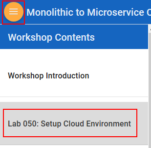

# Monolithic to Microservice Hands on Lab

Welcome to the Monolithic to Microservice workshop. This workshop will walk you through the process of converting a portion of a legacy java application into a microservice based application leveraging Autonomous Transaction Processing, Oracle Kubernetes Engine, Oracle Container Information Registry, Visual Builder Cloud Service and the Oracle Cloud Infrastructure.

### **Step 1**: Acquire an Oracle Cloud Trial 

- Bookmark this page for future reference.

- Please click on the following link to create your <a href="link.to.the.trial.signup.page" target="_trial_">Free Account</a>, and complete all the required steps to get your free Oracle Cloud Trial Account. When you complete the registration process you'll receive a $300 credit that will enable you to complete the lab for free.  Additionally, you'll have 1000s of hours left over to continue to explore the Oracle Cloud.

  - Soon after requesting your trial you will receive the following email. Once you receive this email you can proceed to the next step.

  

### **Step 2**: Navigate to Lab 050

  - _You can see a list of Lab Guides_ by clicking on the **Menu Icon** in the upper left corner of the browser window.

  

You're now ready to continue with [**Lab 050**](LabGuide050.md).
