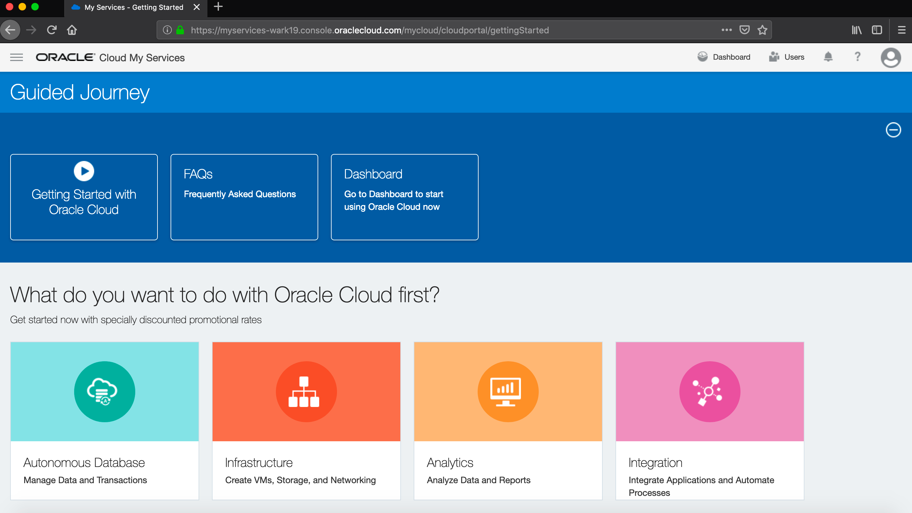
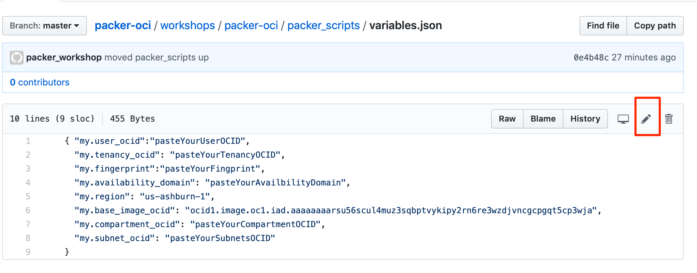
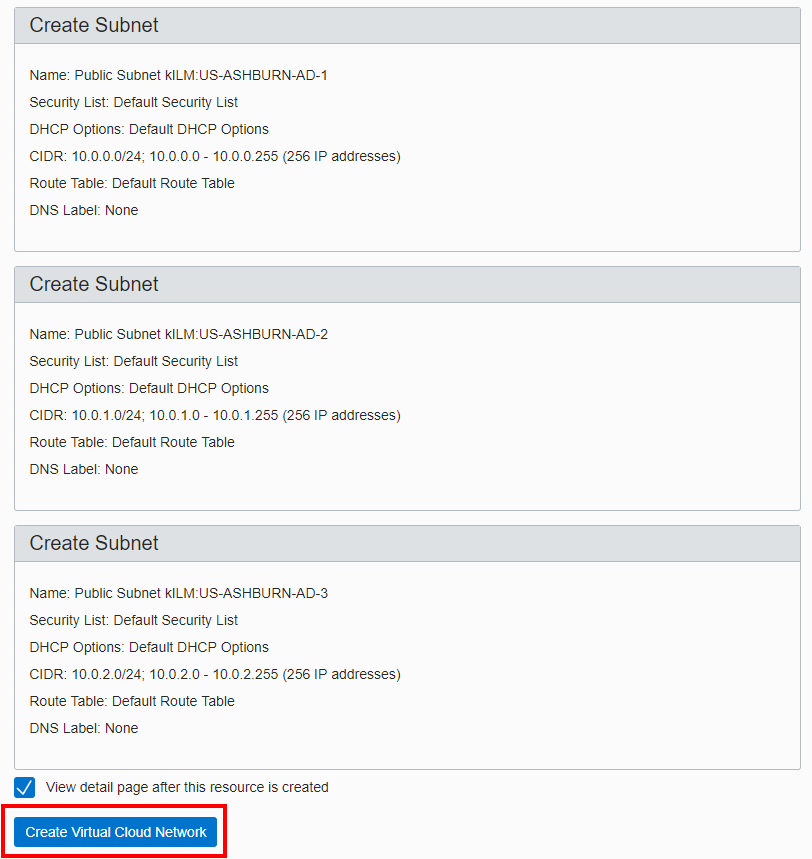
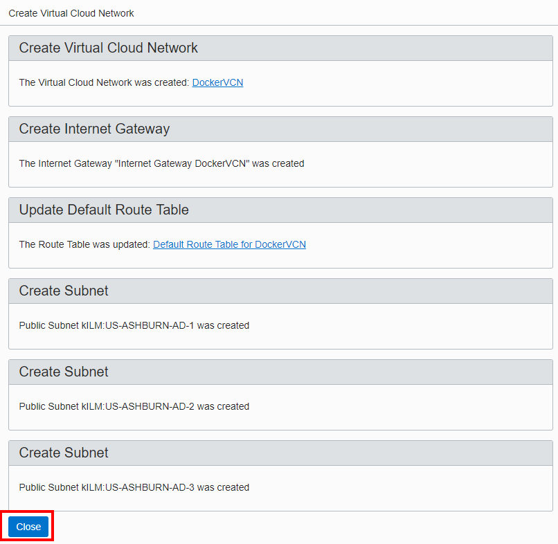

# Packer Workshop - Cloud Infrastructure Configuration


## Introduction

In this lab we will obtain an Oracle Cloud Trial Account, login into your Trial, create a VCN (Virtual Compute Network) and Compartment,create a ssh key pair,  this enables you to create a Custom Image in OCI from your laptop.

***To log issues***, click here to go to the [github oracle](https://github.com/oracle/learning-library/issues/new) repository issue submission form.

## Objectives

- Obtain an Oracle Cloud Trial Account
- Create the baseline infrastructure to support a  Compute image, you'll create and learn about:

  - a Compartment
  - a Virtual Cloud Network
  - Security Lists
  - Creating and using an SSH key pair
- Fork Git repo to your account for editing

## Required Artifacts

- Laptop (Windows, Mac or Linux)
- If running from Windows: [Putty and PuttyGen](https://www.chiark.greenend.org.uk/~sgtatham/putty/latest.html)
- Oracle Cloud Trial account
- A Github account (https://github.com) 

**Note:** This workshop runs from a cloud instance to minimize changes/additions to the students laptop.  We install packer on a Compute instance in the cloud.  If you would like to install (packer & git) locally, it should work, with little/no modification, on both Mac and Windows machines.

# Log into your Trial Account and Create Infrastructure

You will create all required infrastructure components within your Trial account.

## Your Cloud Trial Account

### **STEP 1**: Obtain your Oracle Cloud Trial Account

- If you haven't already, please applied for your Oracle Cloud Trial Account.

Sign up

### **STEP 2**: Log in to your OCI dashboard

- Once you receive the **Get Started with Oracle Cloud** Email, make note of your **Username, Password and Cloud Account Name**.

  

- From any browser go to. :

    [https://cloud.oracle.com/en_US/sign-in](https://cloud.oracle.com/en_US/sign-in)

- Enter your **Cloud Account Name** in the input field and click the **My Services** button. If you have a trial account, this can be found in your welcome email. Otherwise, this will be supplied by your workshop instructor.

  

- Enter your **Username** and **Password** in the input fields and click **Sign In**.

  

  Your should see the *Guided Journey* welcome page.

 

### **STEP 3**: Fork packer-oci

Using git is very common for cloud development, it provides source control and management of software and documenation.  For the purposes of this workshop, we'll make use of GitHub for its ability to store and edit a couple of files that we'll use in image creation.

By forking our workshop's github repository to YOUR github account, you have a working copy of this lab, allowing you to edit files using the web interface of github, which we felt was easier than learning VI :-)

- From a **new window** any browser, go to github.com/packer-workshop/packer-oci

- Click **Fork** in the upper right hand corner of the browser. **Sign in** if prompted.

    

  **NOTE:** If prompted, choose to fork the repository to your account (this may occur if your account is also a member of an organization on GitHub).

  
  you might catch :
  
  
-  You will see that a copy of the packer-oci repository is now in your github account.  This will allow you to make changes to scripts to connect them with your Cloud Account.

   

-  Edit variables.json using the browser interface to github by first navigating to "workshops/packer-oci/packer_scripts.  There, you should see:

   

   - Click the filename **variables.json**

   

As you navigate around Oracle Cloud Infrstructure, you will want to keep this file open to collect the required identifiers.  As we create things like compartments and networks, you be asked to paste identifiers into this file.  While is seems daunting, it only takes a couple of minutes.

### **STEP 4**: Create a Compartment

Compartments are used to isolate resources within your OCI tenant. User & Group-based access policies can be applied to manage access to compute instances and other resources within a Compartment.

- In the top left corner of the dashboard, click the **hamburger menu**

  
  

- Select to expand the **Identity** submenu, then click **Compartments**

  

  - Click **Create Compartment**

    

  - In the **Name** field, enter any name you want. For this example we will be using the name `Packer` going forward. Enter a **Description** of your choice. Click **Create Compartment**.

    

  - In a moment, your new Compartment will show up in the list.

    

## Collect Packer Compartment's OCID ## 

  - Now you can copy the new compartments OCID to the variables.json file from step 3 by using the *copy* link

  

Update variables.json's, compartment:

  

### **STEP 5**: Create a Virtual Cloud Network

We need a VCN to define the network we'll use in the `Packer` compartment (_Or the name you used for your compartment_). This Virtual Cloud Network is where things like Subnets and Security Lists get defined for each Availablity Domain in your Tenancy. Oracle Cloud Infrastructure is hosted in regions and availability domains. A region is a localized geographic area (e.g. PHX or IAD), and an availability domain is one or more data centers located within a region (e.g. IAD - AD1). A region is composed of several availability domains. Availability domains are isolated from each other, fault tolerant, and very unlikely to fail simultaneously. Because availability domains do not share infrastructure such as power or cooling, or the internal availability domain network, a failure at one availability domain is unlikely to impact the availability of the others.

All the availability domains in a region are connected to each other by a low latency, high bandwidth network, which makes it possible for you to provide high-availability connectivity to the Internet and customer premises, and to build replicated systems in multiple availability domains for both high-availability and disaster recovery.

- Click the **hamburger icon** in the upper left corner to open the navigation menu. Under the **Networking** section of the menu, click **Virtual Cloud Networks**

    

  - Select your compartment from the LOV.

    

  - Click **Create Virtual Cloud Network**

    

  - Fill in the follow values *Name, Network+Related Resources) as highlighted below:

    

    

- Click **Create Virtual Cloud Network**

- Click **Close** on the details page after noticing the VNC and Subnets created.:

    

This means that you have a network, "packer-build" defined to have 3 subnets, each one in an isolated "availability domain.

- You will see:

    

- **Click** on the Packer-build VCN to get OCID of the subnets.   

## Collect Packer-build subnet OCID ## 

  - Now you can **copy** one of the subnet's OCID to the variables.json file from step 3 by using the *copy* link.  For consistantcy, we suggest AD-1 (at the bottom).  You wont run into problems as long as you pick the matching subnet & AD (e.g AD2 with Subnet2
   
  

  - Back in your browser window, update variables.json:

      

Now you have your compartment and subnet defined in your variables file.

### **STEP 6**: Add a Security List entry

A security list provides a virtual firewall for an instance, with ingress and egress rules that specify the types of traffic allowed in and out. Each security list is enforced at the instance level. However, you configure your security lists at the subnet level, which means that all instances in a given subnet are subject to the same set of rules. The security lists apply to a given instance whether it's talking with another instance in the VCN or a host outside the VCN.

- Click on the **packer-build** and then "Default Security List for packer-build" under **Security Lists**

    

    

For the purposes of the upcoming Packer-built image deployments, we need to add a couple of Ingress Rules that allow VNC access from the Internet to ports 5910 and 5911. 

- Click **Edit All Rules** and then select **+ Another Ingress Rule**

  **`NOTE: Our goal is to add new rule, not change existing ones...`**

    

    

- **Enter the following as Rule 4 (or the next in your tenant)**

**NOTE:** Leave all other values at default

```
Source CIDR: 0.0.0.0/0
Destination Port Range: 5910-5911
```

- Click the **Save Security List Rules** button at the bottom of the page

    

- Your Ingress Rules should look like:

    

 This opens port 5910 & 5911 to the public internet! for the purposes of this lab, we should be fine.  If you do this in any other account (e.g. not your 30-day trial), pay close attention to the ports your open.  You can enter very narrow port ranges to lock port access down to a single corporate network, or corporate networks + hosted servers specifically designed to access and audit administrative access to cloud instances.  

### **STEP 7 Mac **: Create SSH Key Pair (Linux or Mac client)

Before we create the Compute instance that will let us install packer, we need to create an ssh key pair so we will be able to securely connect to the instance.

**NOTE:** `This step focuses on key pair generation for Linux or Mac based terminal sessions. If your going to run your terminal sessions from a Windows client then skip to STEP 7`

- In a `Linux/Mac` client terminal window **Type** the following (**You don't have to worry about any passphrases unless you want to enter one**)

cd Keys (taking your into your directory)

sh-keygen -b 2048 -t rsa -f packerkey
```
mkdir Keys
cd Keys
ssh-keygen -b 2048 -t rsa -f packerkey
```
- Your key pair is now in the current directory.  You will have two files (the pair) which make up the symetric key.  The private key should remain only in secure locations to protect from misuse.  

  

- **NOTE for Linux and Mac Clients:** Just open up the pubic key file in an editor (vi) and select / copy the entire contents to be used in Step 1 of the next lab (200).   

```
vi packerkey.pub
```
   
    
### **STEP 7 Windows**: Create SSH Key Pair (Windows client)

For Windows clients this example will show the use of PuttyGen to generate the keypair. [Putty and PuttyGen](https://www.chiark.greenend.org.uk/~sgtatham/putty/latest.html) are available for download.

- Run **PuttyGen** and click **Generate**

    

- Once the generation process completes click the **Save Private Key** button and save to a directory of your choice.

- If prompted to save without a passphrase click yes.

    

**NOTE:** `Do not save the public key as the format is not compatable with Linux openSSH.

- Instead, **Select the entire Public Key in the display and right-click copy**. `This content will be pasted into the Create Instance dialog in Step 1 of Lab 200.`

    

**This completes this Lab!**

**You are ready to proceed to [Lab 200](Lab200.md)**
