# Packer Workshop - Exploring OCI

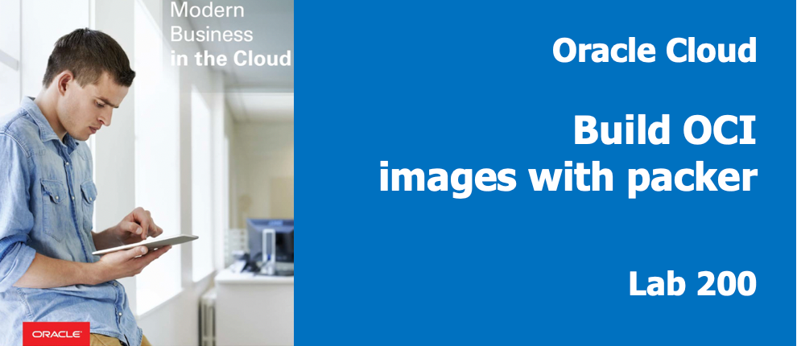

## Introduction

In this lab you launch a compute instance, install packer and create an environment for building your first, custom image of CentOS 7.  You will learn to securely connect to this compute image using secure shell and to create keys used to secure API calls.  You will gain familiarity with Oracle Cloud Infrastructure's operation and security features.

## Objectives

- Create Compute Image
- Install Packer & git in Client Compute Image
- Gather remaining OCIDs for Cloud objects
- Create a RSA Keypair for API calls
- Add Public API key to Cloud User
- Secure VNC by changing the password

## Required Artifacts

- Oracle Cloud Account - (configured in Lab100)
- Your public ssh key from lab 100
- _DevDesktop.json_ file file open in GitHub

### **STEP 1**: Create an OCI Compute Instance

You will now create a CentOS-based Compute instance and will install public key half of the key-pair you just generated.  This is the Client Image.  The Client Image is a stand-in for your laptop or development workstation as some attendee's might have issues installing on their laptop due to administrative controls or policies.  You will then use the Private half of the keypair to connect from your laptop, over ssh, to the Client Image.

**`NOTE: Feel free to install packer and git on your laptop if you feel comfortable doing so...

- From your OCI console, use the **hamburger menu** in the upper left hand corner,
select **Compute-->Instances**

 

- Click **Create Instance**

  

- **You will Select, Leave Default or Type** the following in the `Create Compute Instance` section of the dialog:

- Enter `packer-builder` as your Instance Name

```
Name: packer-builder
Availability Domain: AD 1 (please Use default AD 1)
Boot Volume: Oracle-Provided OS Image
Image Operating System: CentOS7  <change to>
Shape Type: Virtual Machine (Default)
Shape: VM.Standard2.1 (Default)
SSH Keys: Choose SSH Key Files
```

- After entering the _packer-builder_ instance name click the **Change Image Source**.

  

- Select **CentsOS 7** and click **Select Image**.  

  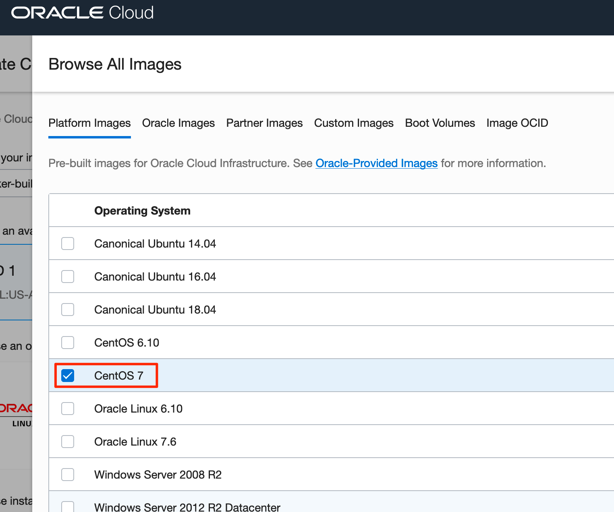

- Verify CentOS 7 is now on the page:

  

***Note:  The images build date might be more recent than the screen capture below.***

- Scroll down further on the page and select your PUBLIC SSH Key

**NOTE:** A public key (at least one) is deployed to each OCI cloud instance.  This allows you to connect to the running instance the public key was deployed to, with the private key held securely on your laptop.  The public key can be pasted into the SSH key field by selecting the "Paste SSH keys" radio button. `The public key should be pasted as a single line` or it can be selected by navigating to the file in your browser

- You can either select your packerkey.pub from your filesystem or paste it

  

- In the Configure networking Section you will take ALL of the defaults as shown:

  

- Click **Create**

In less than one minute, you should see your instance provisioning and the Public IP Address.  You will notice the OCID has been generated.  This unique identifier can be used to refer to this image using the REST API or in other processes.

  

- `Make a note of the Public IP Address as you will be using this in the next step.`

In about 2 1/2 minutes, you should see your instance in the running state.  This mean that the image boot has completed and will available via ssh moments later when the sshd service has started.

  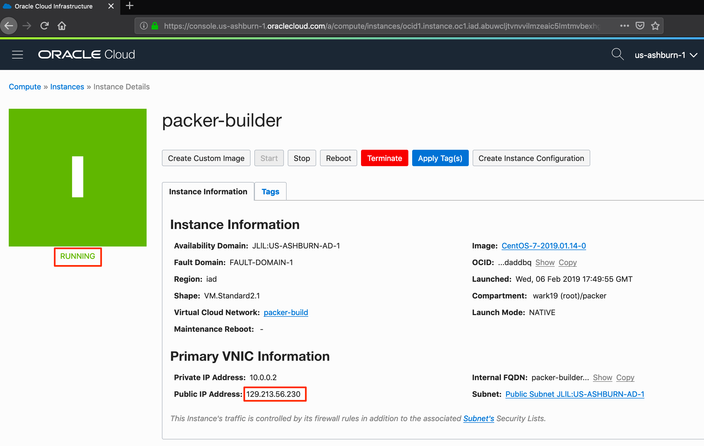

### **STEP 2**: Connect via SSH to the Instance

Next, you will SSH into the Compute instance and install packer and git.  You will use the private ssh key to connect with the newly started image.  Any SSH client can be used, but the examples here are the most common, Putty (for Windows) and built-in ssh for Linux/Mac Laptops.

#### **Windows:**

- For a Windows client launch Putty, select the **Session** section and type in the IP address:

   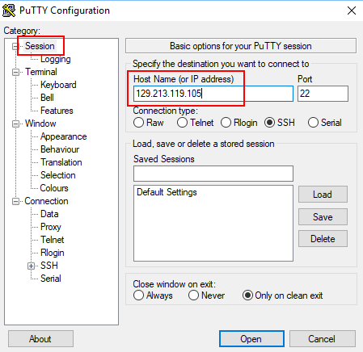

- Select the **Data** section and enter the following as the username:

```
opc
```

- The public key should look like similar to:
 or it can be selected by navigating to the file in your browser
  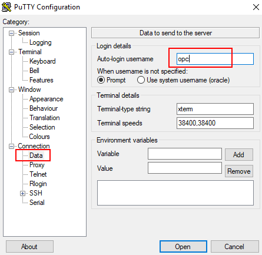

- Select **SSH-->Auth** and browse to the Private Key, packerkey, you created back in Step 7:

  

- Click the **Open** button. You will presented the first time with am alert message. Click **Yes**

  

- You are logged into the Compute image:

  

**NOTE:** For Linux and Mac client sessions "cd" into the directory where your key pair is. Your packerkey file has the permissions of "600" or "rw---------".  The private key allows you to ssh into the compute instance `substituting your IP address`, which already has the public key you specified (in the instance create step) deployed to the opc user.

#### **Macs:**

Launch a terminal window and ssh to the packer-builder image
Example:

```
ssh -i ./packerkey opc@<yourIPaddress>
```

- Linux / Mac screenshot:

  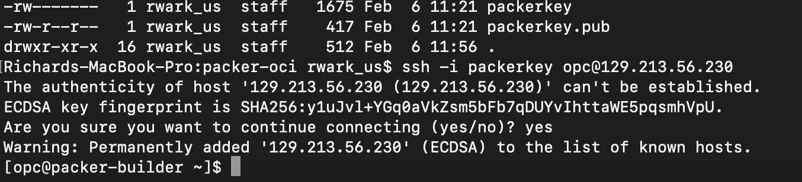

### **STEP 3**: Install and configure Packer and GIT

Packer and Git are required for the subsequent labs. You will install the Docker engine, enable it to start on re-boot, grant docker privileges to the `opc` user and finally install Git.

- In your Putty session's Terminal or Terminal window running the ssh session, **Cut and Paste** the following:

```
sudo -s
yum -y install git
wget https://releases.hashicorp.com/packer/1.3.4/packer_1.3.4_linux_amd64.zip
unzip packer_1.3.4_linux_amd64.zip -d /usr/local/bin
exit
mkdir ~/.oci
alias packer=/usr/local/bin/packer
rm packer_1.3.4_linux_amd64.zip
echo "Complete"


```

This uses the yum package manager, already setup in Oracle's cloud, to download and install git.  The script then downloads packer and upzips it in /usr/local/bin.  It then creates a directory (called ~/.oci) and creates an alias for the packer command in /usr/local/bin.

- **Type** the following to verify installation:

```
packer --version
git --version
```

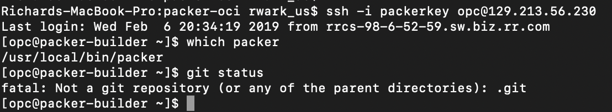

### **STEP 4**: Gather remaining OCIDs

Collect your User's OCID and add Generate the API keypair.

  -  Navigate using the **hamburger menu** to *Identity-> Users*

   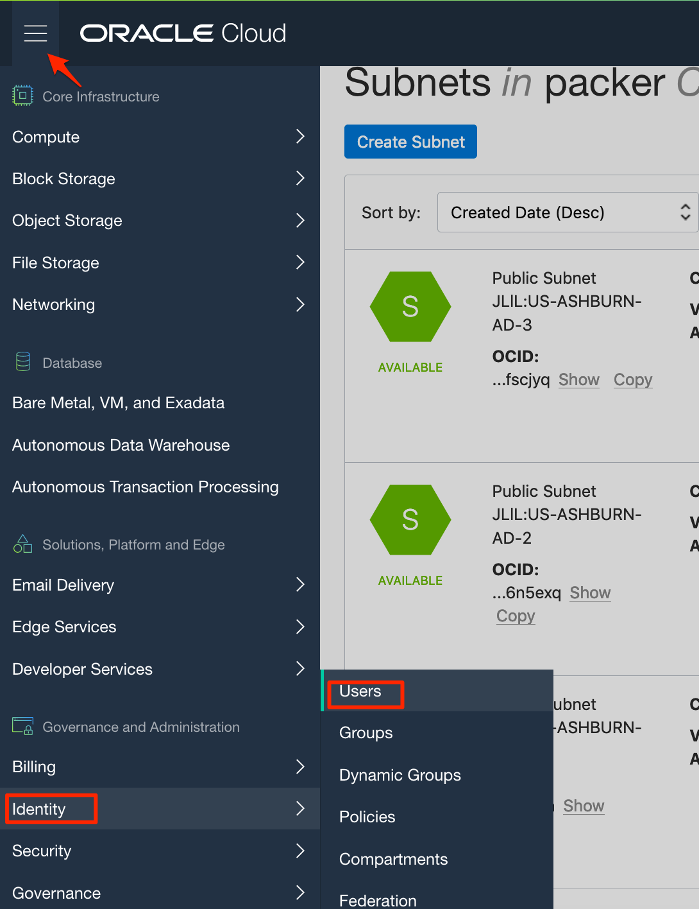

  - Copy the OCID from the non-federated User entry (the one without the oracleidentitycloudservice prefix)

   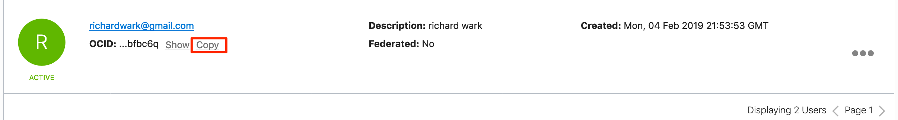

  - Paste this into your open _DevDesktop.json_ inside the **my.user_ocid** field in the file:

   

### **STEP 5**: Create public API key in .pem format

On the Compute instance, where packer is installed, you will create a second keypair, RSA in .pem format, used to authenticate your (and packer's) use of APIs.  You will upload the public piece of this key to your user and place the resulting fingerprint in your _Variables.json_ file in the GitHub editor.

- Do this by running the **openssl genrsa** command, specifying ~/.oci (a directory under the opc users's home directory), in the command:

    ```
    openssl genrsa -out ~/.oci/packer_api_key.pem 2048
    ```

   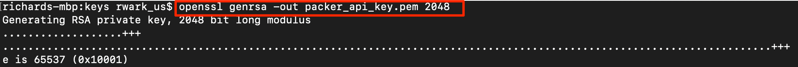

That generated the private key.

- Confirm the format by executing the following commands:

    ```
    more ~/.oci/packer_api_key.pem
    ```

    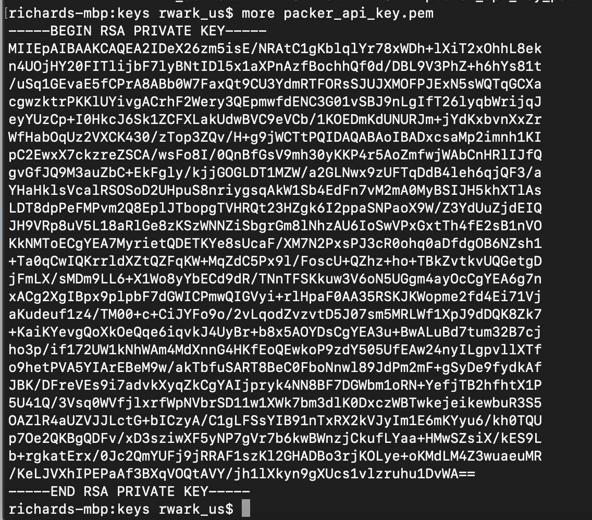

- Next you generate the PUBLIC API key which you will add to your cloud user. To do so, run the **openssl** command taking the private key and exporting the RSA formatted PUBLIC key

    ```
    openssl rsa -pubout -in ~/.oci/packer_api_key.pem  -out ~/.oci/packer_api_key_public.pem
    ```

- Copy your **packer_api_key_public.pem** file contents from the console window by executing the command below and coping the text from the console.
    ```
    more ~/.oci/packer_api_key_public.pem
    ```

    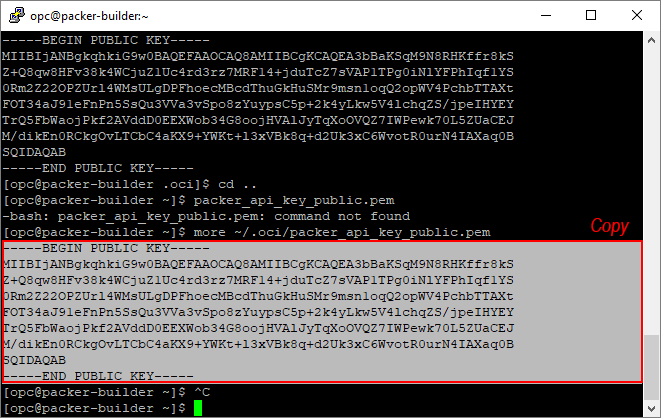

- Navigate back to the Cloud Console and drill into your user. Select the non-federated **User**:

  

- Select **Add Public Key**  

  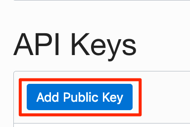

- **Paste** API key, ALL LINES from the Public API Key - packer_api_key_public.pem, into the text box and click **Add**

  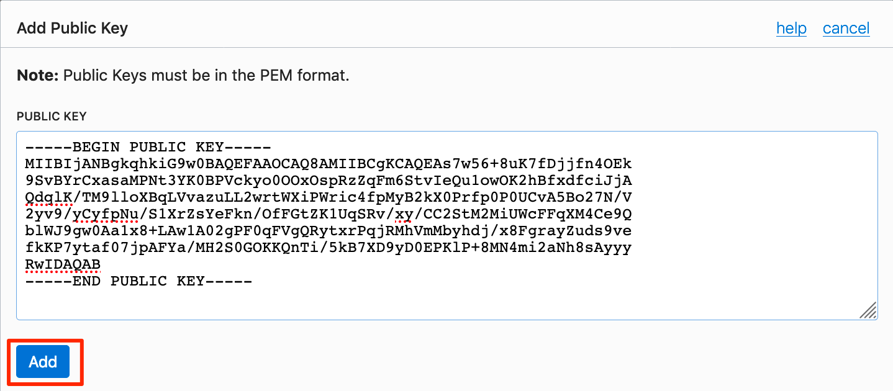

- You should see the fingerprint appear after **hitting "Add"** Now, **Copy** the string after "Fingerprint:"

  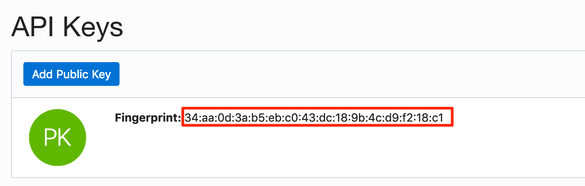

  _This creates a trust relationship between the Cloud Account and the keypair deployed.  Now, with the private key from this keypair, the identity of a call with the User's OCID can be verified by the public key stored in OCI._

- **Paste** the fingerprint into your _DevDesktop.json_ file inside the **my.fingerprint** field your GitHub editor, it should look as follows:

   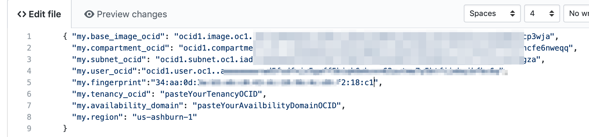

### **STEP 6**: Gather OCIDs for Tenancy and Availability Domain

- You now just need the OCID of the Tenancy and the Availability Domain. For The tenancy's OCID, navigate using the **hamburger menu** to **Administration--> My Tenancy Details**  

  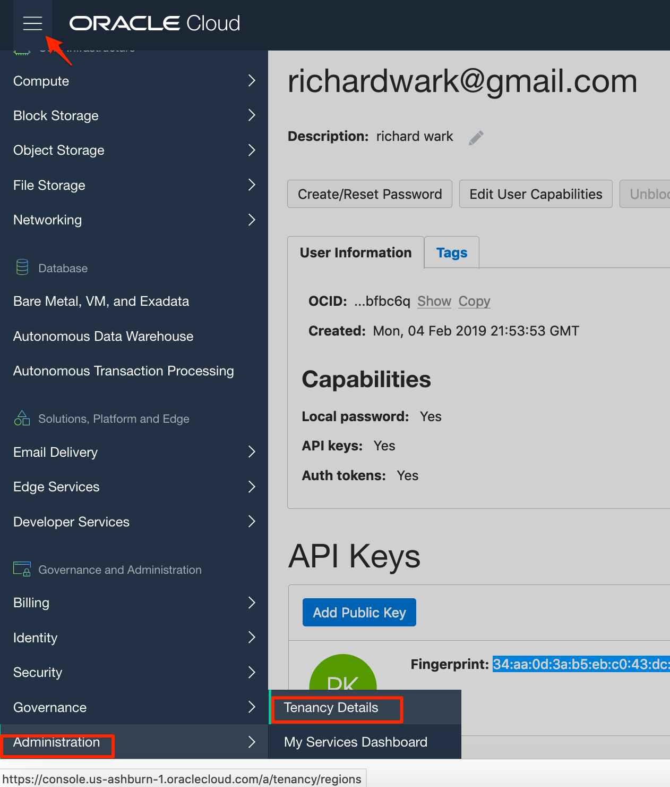

- **Copy** the OCID

   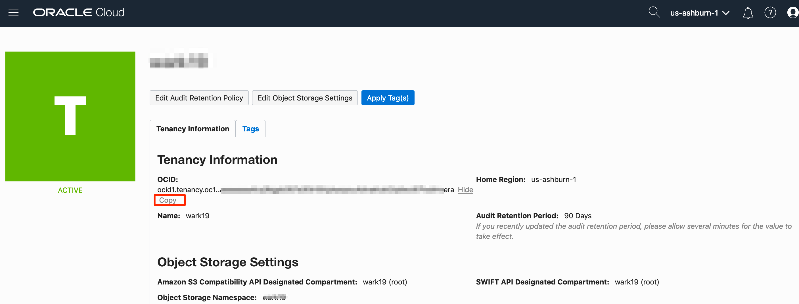

- **Paste** the OCID into the **my.tenancy_ocid** field  _DevDesktop.json_ in GitHub

  

- Navigate back to your compute window by clicking _Hamburger Menu --> Compute_

  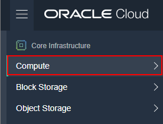

- **Copy** your Availability Domain from the instances page.  You'll notice that it isn't an OCID, but a string listed on the lower left, under the Compartment drop-down

  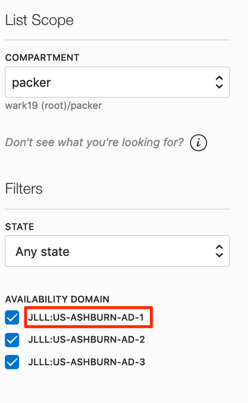

- **Paste** into the **my.availability_domain** field in the _DevDesktop.json_ file:

  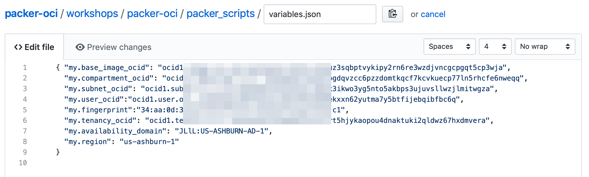

- Add your **comments** and hit **Commit Changes**

  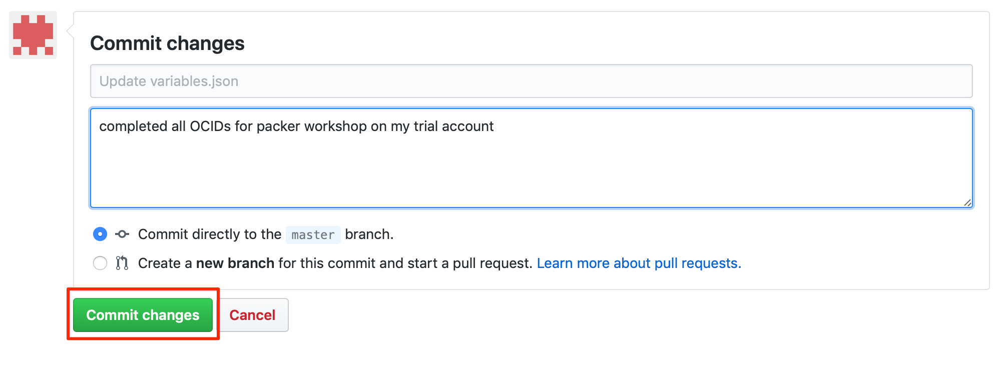

- Inside github navigate to the **packer-oci/workshops/packer-oci/packer_scripts/SharedCentos/** folder and click on the file **changepasswordVNC.sh**.

  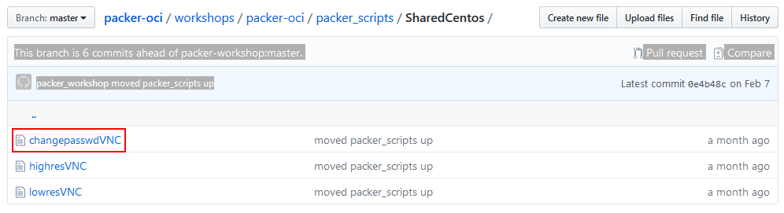

- **Edit** the file **changepasswordVNC.sh** by clicking the Pencil icon and **Change** the password from "Oracle123". Choose something that you will remember.

  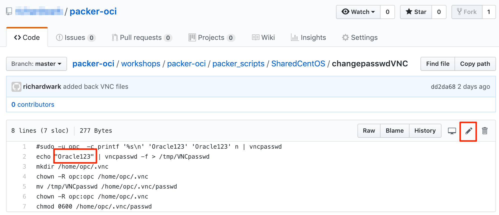

- Add your comments and hit **Commit Changes**

  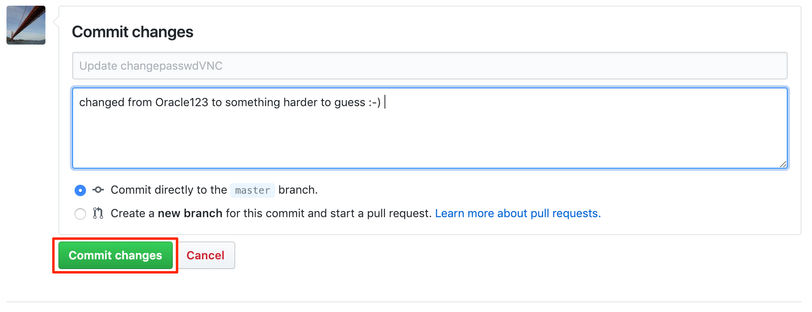

### **STEP 8**: Clone your repository

Your _DevDesktop.json_ file is committed to Github with the OCIDs which match your cloud environment.  You will clone your personal github to the Compute Instance creating a local copy of both the _DevDesktop.json_ and packer build scripts.

- In your terminal window, **type**

  ```
  git clone https://github.com/<yourGithubAccount>/packer-oci.git
  ```
- You should see:

  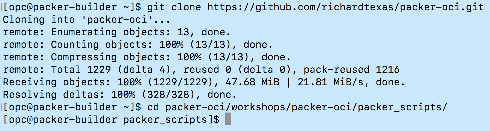

- In your terminal window, **review** your _DevDesktop.json_, you should see the OCID and fingerprint you copied in previous steps to your Github repository.

  ```
  cd packer-oci/workshops/packer-oci/packer_scripts/
  more DevDesktop.json
  ```

 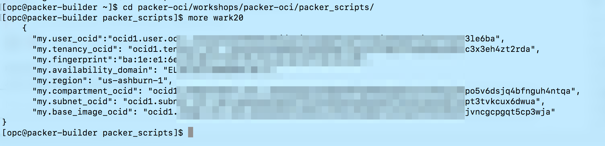

**You are ready to proceed to [Lab 300](Lab300.md)**
