# Packer Workshop - Your environment  Set Up

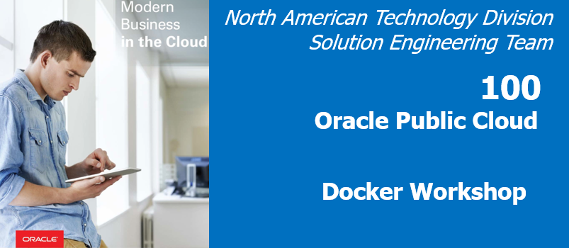

## Introduction
In this lab we introduce the basics of packer. The goal will be to create your first image and log into an instance of that image.

To do this, you will first need packer installed on your laptop.  Packer can then use "providers" to build images in various cloud (OCI, AWS, Abibaba) and virtualization environments.

***To log issues***, click here to go to the [github oracle](https://github.com/oracle/learning-library/issues/new) repository issue submission form. We look forward to your questions and suggestions for improvement.

## Objectives

- Prep your laptop

## Required Artifacts

- Oracle Cloud Account - (configured in Lab100)
- Your Laptop (with the ability to install software)

# Install Packer via brew

Installation of Packer can be done most easily with "brew":
brew install packer

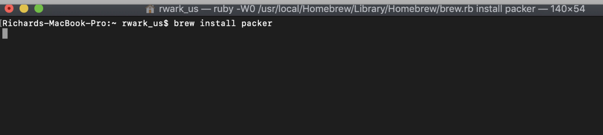

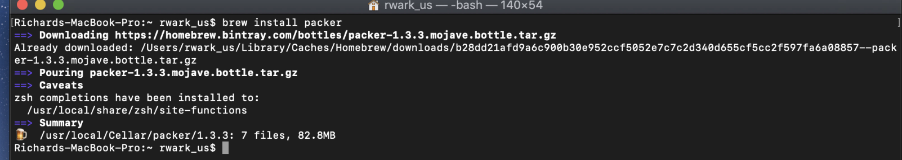

**NOTE**: If you don't have homebrew installed on your Mac, you an do so in a terminal windows with: "/usr/bin/ruby -e "$(curl -fsSL https://raw.githubusercontent.com/Homebrew/install/master/install)"" 

### **STEP 2**: Verify install

brew install packer


### **STEP 2**: Verify that Docker is running

**NOTE: For the duration of the Labs it's OK that the login user (holuser vs. opc) and the Docker version may vary from the screenshots**

- **Type** the following:

```
 cd
 docker version
```

The information on your docker engine should be displayed:

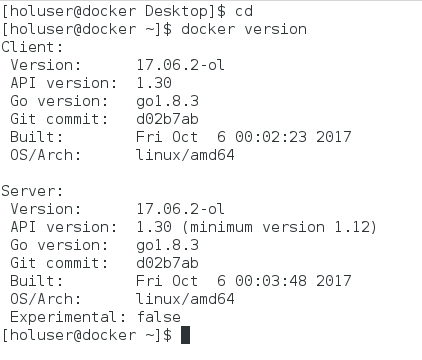

### **STEP 3**: See What is running

Let's take a quick look at what is running in the docker engine, if this is a new environment, you should see no docker containers running.

- **Type** the following:

```
docker ps
```

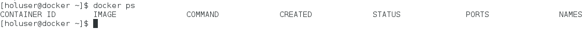

### **STEP 4**: Run the restclient docker image from docker hub

We will now download and create a container based on an existing docker image stored in the Docker Hub. It uses a JSON formatted datafile to serve up test data via its exposed REST service. Docker looks for the designated image locally first before going to Docker HUB.

- Let's take a look at what the docker **run** command options do:
    - "-d" flag runs the container in the background
    - "-it" flags instructs Docker to allocate a pseudo-TTY connected to the
    container’s stdin, creating an interactive bash capable shell in the container (which we will use in a moment when we connect into the container)
    - "--rm" When this container is stopped all resources associated with it (storage, etc) will be deleted
    - "--name" The name of the container will be "restclient"
    - "-p" Port 8002 is mapped from the container to port 8002 on the HOST
    - "-e" Environment variables used by the application. "DS" setting designates the JSON datasource.

- **Type OR cut and paste** the following (all on one line):

```
docker run -d -it --rm --name restclient -p=8002:8002 -e DS='json' wvbirder/restclient
```


### **STEP 5**: Check running containers

Again using the `docker ps` command, we should see our newly spawned docker container

- **Type** the following:

```
docker ps
```

- Note that the container id is unique, and the container's port is mapped to 8002, which is the same as the Host's port.


### **STEP 6**: Check the Application with a browser

- We need the Public IP address to test the deployment. Navigate in a browser to your Oracle Trial account and from the hamburger menu in the upper left hand side of the page select go to **Compute-->Instances**:

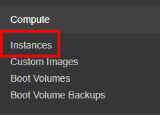

- Click on the **Docker** instance link

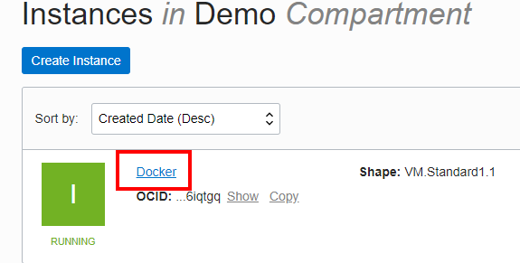

- Note the Public IP address (In this example, `129.213.119.105`

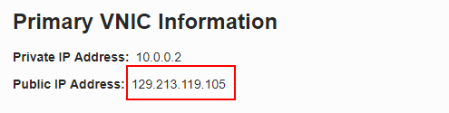

- Go to this URL substituting your Public IP address

```
http://<Public-IP>:8002/
```

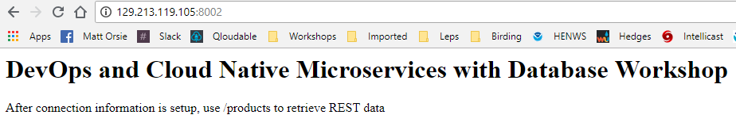

- Now enter this URL into your browser :  `http://<Public-IP>:8002/products`

If your browser contains a JSON Formatter add-on then the output will look something like this (else, it will just be unformatted text, which is OK):

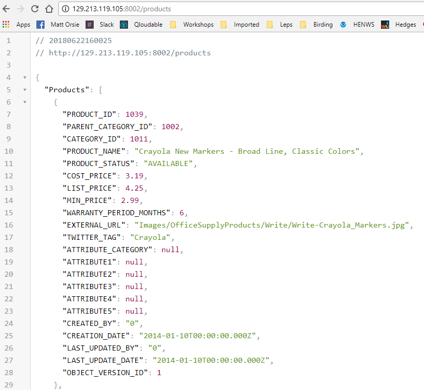

### **STEP 7**: Stop the Container

- Since we started the `restclient` container with the --rm option upon stopping it docker will remove ALL allocated resources

- **Type** the following:

```
docker stop restclient
```

- Now, entering "docker ps -a" (which will show the status of ALL containers RUNNING or STOPPED) shows nothing proving the container was deleted upon stopping it.

- **Type** the following:

```
docker ps -a
```

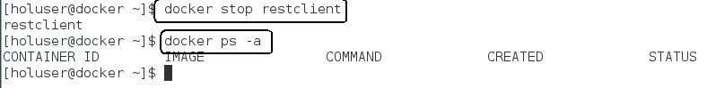

### **STEP 8**: Start another Container with a different HOST Port

- Start another container using the Host's 18002 port:

- **Type** the following:

```
docker run -d -it --rm --name restclient -p=18002:8002 -e DS='json' wvbirder/restclient
```

- If you change your browsers port to 18002, you will see that the Host server is using 18002 and mapping that to our container's port 8002.

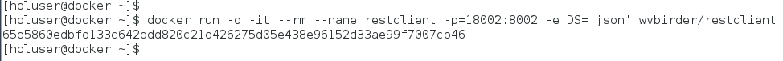

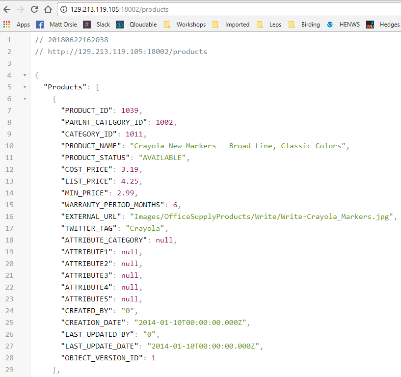

### **STEP 9**: Inspect the Container's Network and IP Address

- You can get various bits of information from the subnet that docker container is running on by inspecting the default network bridge docker creates out-of-the-box. You can create your own networks and assign containers to them but that is out of the scope of this lab.

 - **Type** the following:

```
docker network inspect bridge
```

- This returns information about all the containers running on the default bridge. We see that our `restclient` container is assigned IP Address 172.17.0.2. You can ping that address from the Host server.

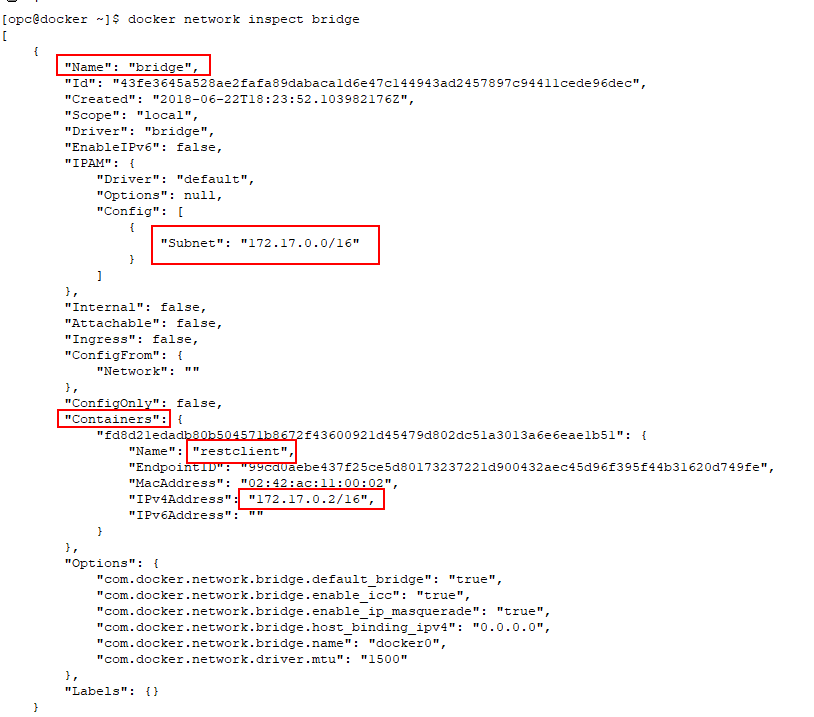

- Ping the `restclient` container IP Address: (in this example the IP was 172.17.0.2)

- **Type** the following:

```
ping 172.17.0.2 -c3
```

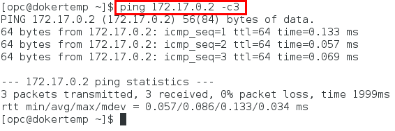

- Finally, **STOP** the `restclient` container as we will be re-provisioning it in Lab 200 by **typing**:

```
docker stop restclient
```


**You are ready to proceed to [Lab 200](Linux200.md)**
