# Packer Workshop - Using Packer: Basic Concepts

  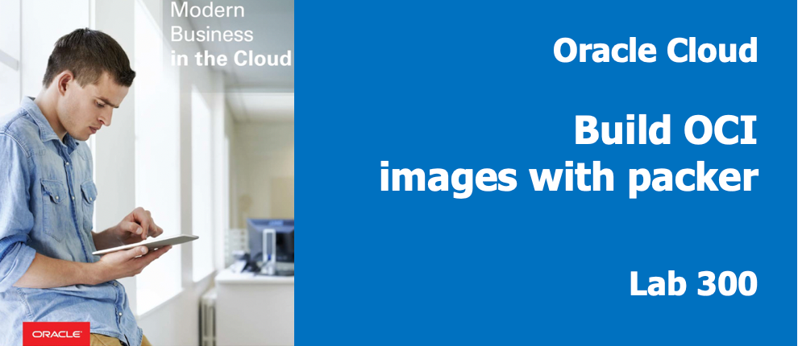

## Introduction

In this lab you install several packages, label your image, upload a configuration file and move it.  

**NOTE:** `If you are pressed for time, feel free to look at the varBuild300.json, if you understand the logic, you can jump to Lab 400 as the builds are cummulative and all the Lab300 "pieces" are in 400,`

## Objectives

- Create an packer image with software installed
- Learn to upload a configuration files from a local machine packer target image
- Log into an Instance of the Custom Image

## Required Artifacts

- Oracle Cloud Account - (configured in Lab100)
- Your Compute Client Image (from lab 200) or packer & git installed locally on your laptop.
- Your git repository with _DevDesktop.json_ file committed and cloned to your Compute Client Image
- Your API Keypair (pem files) with Public Key added to Cloud user

### **STEP 1**: Inspect Packer build-file template: varBuild300.json

You are doing install and configuration steps to get the point across, while being respectful of your time.  When installing software, the download and installation process can be a bit much for a classroom setting, depending on file sizes and complexity.  Let's look at the 3 main pieces of the provisioners section:

- In your ssh session, you should already be in the packer_scripts directory of the cloned repository. **Type:** `more varBuild300.json` in your terminal window to the Compute Client Image.

  ```
  more varBuild300.json
  ```

  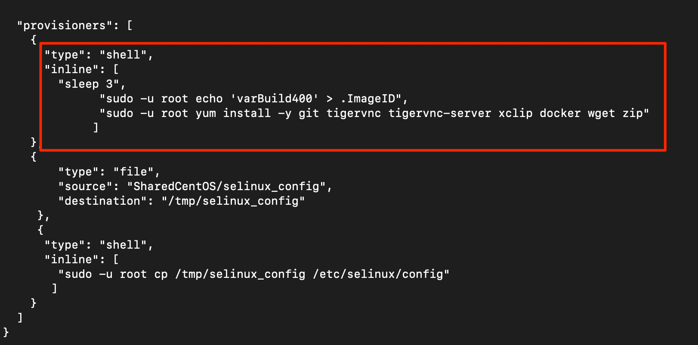

_You are simply writing a label (by echoing a string to the file ".ImageID") to the image which will verify that an image is associated with a particular build - "varBuild300".  You also are using yum to install the tools you see (git, tigervnc, docker, etc.) in the same manner you would at the command-line as opc (a non-root, but sudo-enabled OS user)_

- Next, you will upload a file that will disable Security Enhanced (SE Linux). This would obviously not be appropriate in all environments, but since we're building a Developer Client Desktop, we need to facilitate their productivity. Since the firewall is still set to run by default (in all CentOS7 installations) adequate protections are in place

  

_The file, selinux_config, is a modified version of /etc/selinux/config.  The change is to the SELINUX state, changing from enforcing to disabled._

- To view this, **type:**
  ```
  more SharedCentOS/selinux_config
  ```

  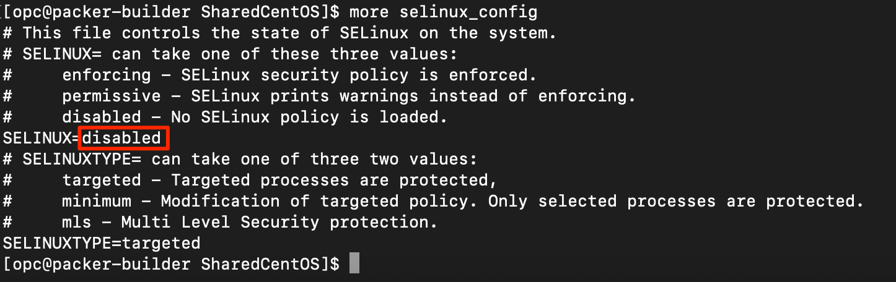

You can see that the file's source is selinux_config from  "packer_scripts/SharedCentOS/ directory.  By breaking files into subdirectories, it will be easier to share and re-use configuration pieces as you build multiple images.

- Lastly, you move the uploaded file, from /tmp/selinux_config - on the packer target, to /etc/selinux/config

  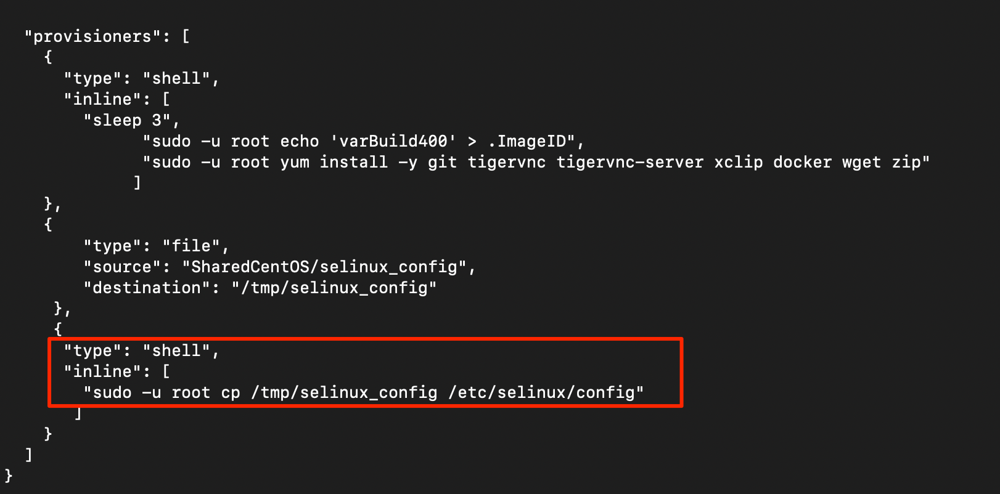

### **STEP 2**: Validate the packer template file

- Run packer validate to make sure your file is valid.  In the terminal window **type**

  ```

  packer validate -var-file=DevDesktop.json varBuild300.json

  ```

  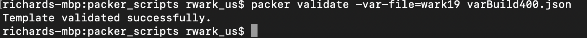

### **STEP 3**: Run Packer Build

- Build with the validated packerfile, In the terminal window **run** the following command.

  ```

  packer build -var-file=DevDesktop.json varBuild300.json

  ```

  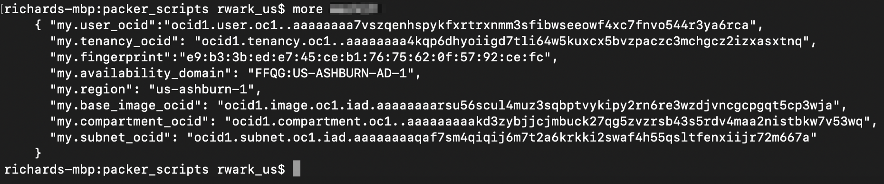

  You will also see the file upload process take place.

  

### **STEP 4**: Launch an Instance of your Custom Image

- **Navigate** to back to your browser's _OCI Console --> Instances_ tab. You should see your custom image being created, then terminated. This will take a couple minutes.

  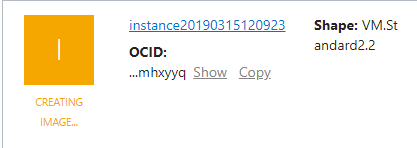

- **Wait** till your script completes, before proceeding to the next step. You should see the following when the script completes.

  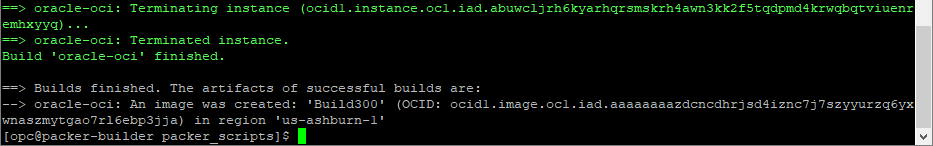

- **Navigate** to _OCI Console --> Custom Images_ .

  

- **Select** the ellipse to the right of the image creation time,  select "Create Instance"

  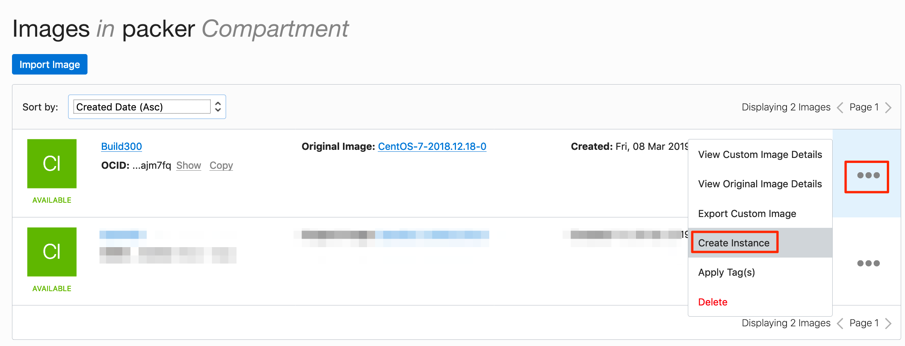

- Select a name for the image and place it in Availability Domain 2

  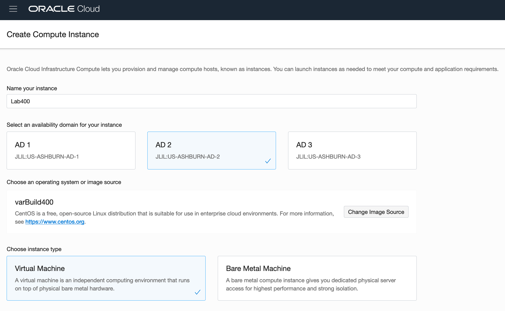

- Paste or choose your public key file, perhaps choosing it if you pasted it last time.

  

- Double check the compartment, VCN, subnet compartment and subnet  

  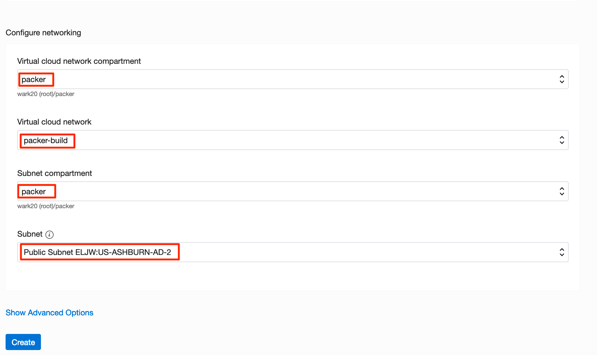

- **Select** Create

  

You will see in the "Provisioning", state for a couple of mins as we create the boot volume and instantiate the image.  

- Note the public IP address of your instance, you will connect to this in the next step.

  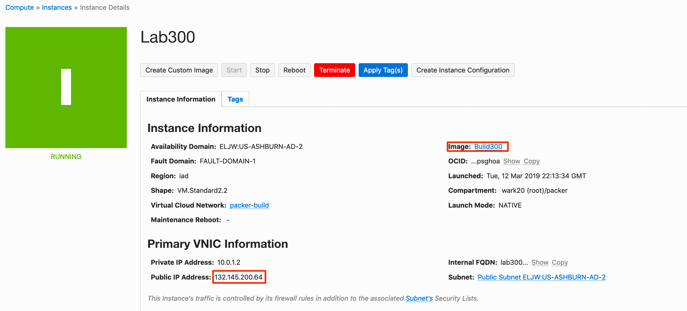

### **STEP 5**: Connect to Custom Instance

- Using the IP address, ssh to your image in a terminal window (Mac/Linux) or with Putty(Windows)

  ```
  ssh -i packerkey opc@<yourPublicIPAdress>
  ```

- ***Accept*** the addition of your machine to the instance's "known_hosts" by typing "yes"

  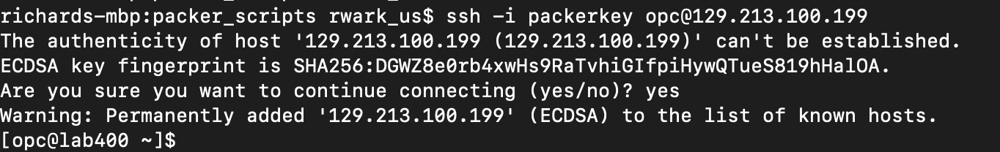

- Start by checking the ImageID we created to track versions.  We should see varBuild300 :

  ```
  more .ImageID
  ```

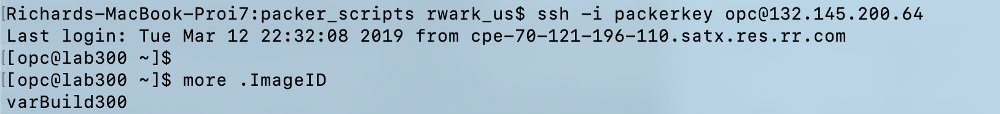

Good, so let's review some of your handywork

- In the connected session, **type** the following:

  ```
  git --version
  ```

  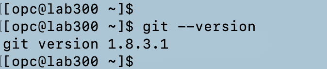


**You are ready to proceed to [Lab 400](Lab400.md)**
