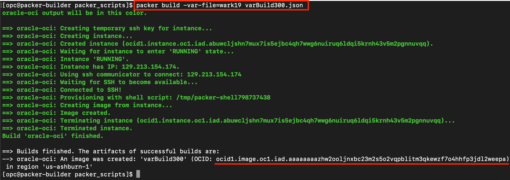

# Packer Workshop - Using Packer:  First Build


## Introduction

In this lab we introduce the basics of packer, this is the fun part. The goal will be to create your first image and log into an instance of that image.

***To log issues***, click here to go to the [ oracle github](https://github.com/oracle/learning-library/issues/new) repository issue submission form. We look forward to your questions and suggestions for improvement.

## Objectives

- Create your first packer-built image
- Understand base images and their use in OCI and packer

## Required Artifacts

- Oracle Cloud Account - (configured in Lab100)
- Your Client Image (from lab 200) or packer & git installed locally on your laptop.
- Your git repository with variables.json and pem file committed 

### **STEP 1**: Locate your working directory
You cloned your github repository to your client (compute image or laptop)  This will download your work this far (OCIDs and Keys) so you don't have to edit 

- In your ssh session, cd to the packer directory and clone the repo:
```
git clone https://github.com/<yourGitHubUsername>/packer-oci
```
- You should see:

    

- Check your variables file to make sure the local repository is correctly cloned.

    

- Verify that you have the private key for the cloud.
```
more <keyfilename>
```
>    

### **STEP 2**: Run Packer validate

Packer has fairly simple features, build and validate.  Let's validate that your packerfile is correct with,
packer validate -var-file=<varfilename> <packerfile> if you're using the suggested filenames, you would enter:
```
packer validate -var-file=yourTenant.json  varBuild300.json
```

  

### **STEP 3**: Run Packer Build

This is where it starts to get good, you've got the setup all done and can now build.

Build with the validated packerfile, packer build -var-file=<varfilename> <packerfile> 

```
packer build -var-file=yourTenant.json  varBuild300.json
```
  
  

Success! Our image has completed the build process and is available to be launched as an OCI instance.  We will do that in both lab 400 and 500, so to complete this lab, just make not of the OCID and that it matches the output of Step 3's "packer build"

  

  
  

**You are ready to proceed to [Lab 400](Lab400.md)**
