# Packer Workshop - Using Packer:  Full Docker Developer Image Build

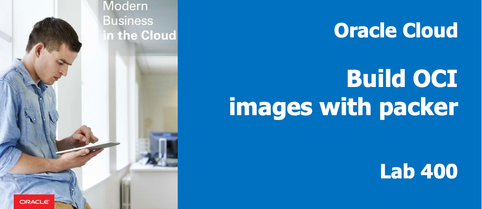

## Introduction

In this lab you build on the concepts of the previous labs, but will add commentary and discussion around more advanced topics.  

## Objectives

- Create an image with a desktop (gnome) and software installed (git, docker)
- Learn considerations for ordering of services and dependencies

## Required Artifacts

- Oracle Cloud Account - (configured in Lab100)
- Your Client Image (from lab 200) or packer & git installed locally on your laptop.
- Your git repository with _variables_.json and key file committed.

### **STEP 1**: Inspect the Packer build template: varBuild400.json

- If not already connected, ssh into your packer-builder virtual machine and navigate to the following directory.

  ```
  cd /home/opc/packer-oci/workshops/packer-oci/packer_scripts
  ```

- In the file varBuild400.json, you will see the components of an example real-world installation. In the terminal window, examine varBuild400.json by typing:

  ```
  more varBuild400.json
  ```

You will notice there are more commands here:

  - Setting of Firewall rule for port 5910
  - Copy Service file for VNC on port 5910 to host
  - Copy Script to change the password for set for VNCServer to host

  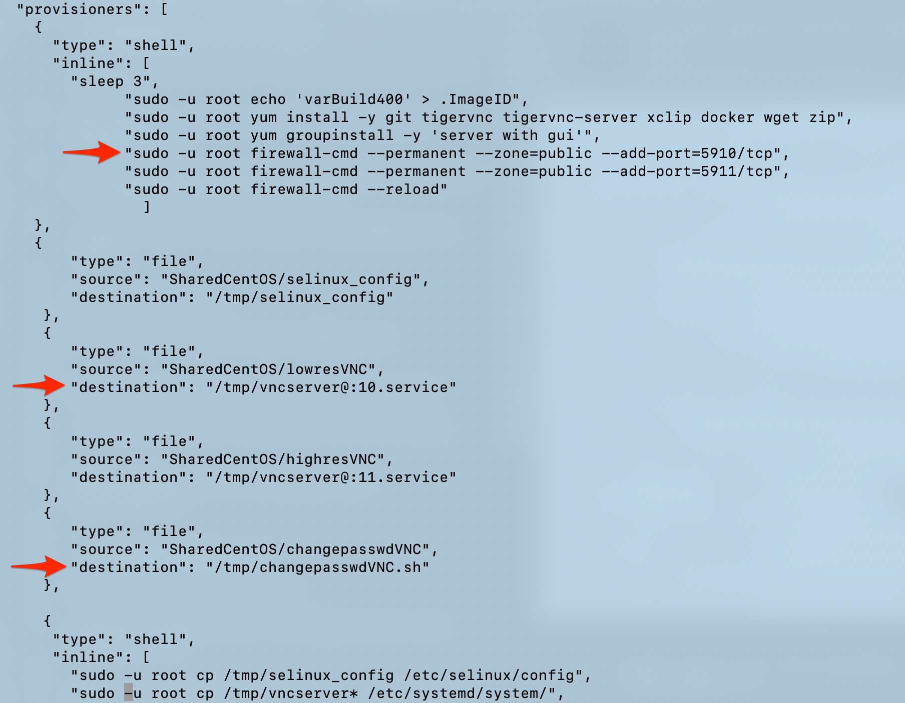

- Later in the same build script, you see the use of the files moved above:

  - Enabling the Service VNCServer on port 5910
  - Enable execute permission on Script to change the password for set for VNCServer to host

  

### **STEP 2**: Validate the Packer build template

- Run packer validate to make sure your file is valid, again using your _DevDesktop.json_ file

  ```
  packer validate -var-file=DevDesktop.json  varBuild400.json
  ```
  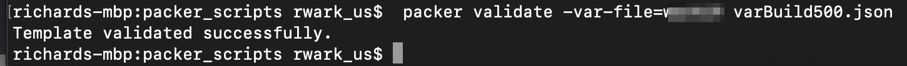

### **STEP 3**: Run Packer Build

- Using your variables file, run a packer build in the terminal window:

  ```
  packer build -var-file=DevDesktop.json  varBuild400.json
  ```

- You can see the build process start running:

   

- You will also see the file upload process take place.

   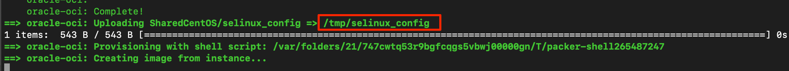

- **Navigate** to back to your browser's _OCI Console --> Instances_ tab. You should see your custom image being created, then terminated. This will take a couple minutes.

    

- **Wait** till your script completes, before proceeding to the next step. You should see the following in your terminal window before proceeding.

    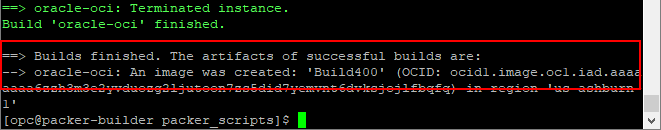

### **STEP 4**: Launch an Instance of your Custom Image

- **Navigate** to _OCI Console --> Custom Images_ to see your new image.

  

- Using the ellipse to the right of the image creation time, **select** "Create Instance"

  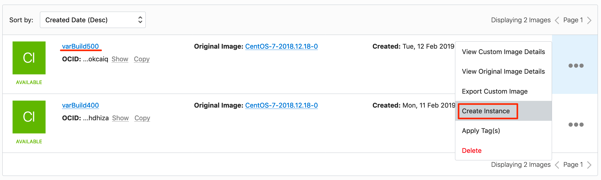

- **Select** a name for the image (Lab400) and place it in  Availability Domain 3

  

- **Paste** or choose your public key file.

  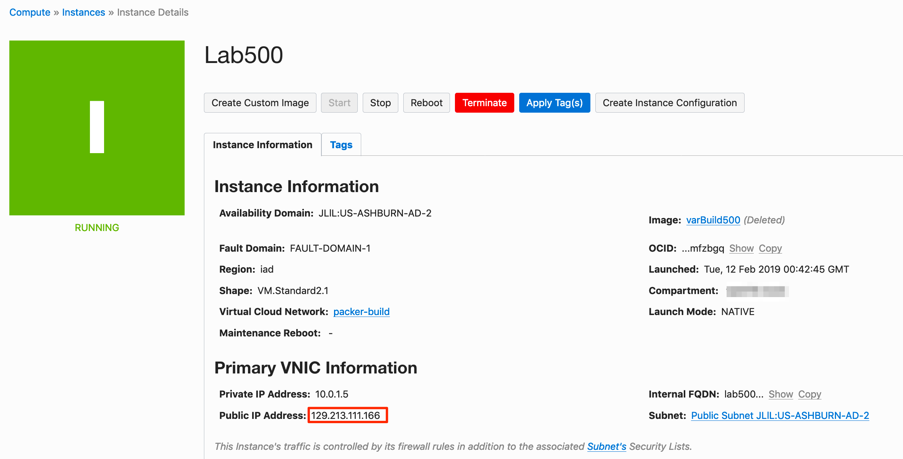

- Double check the compartment, VCN and subnet  

  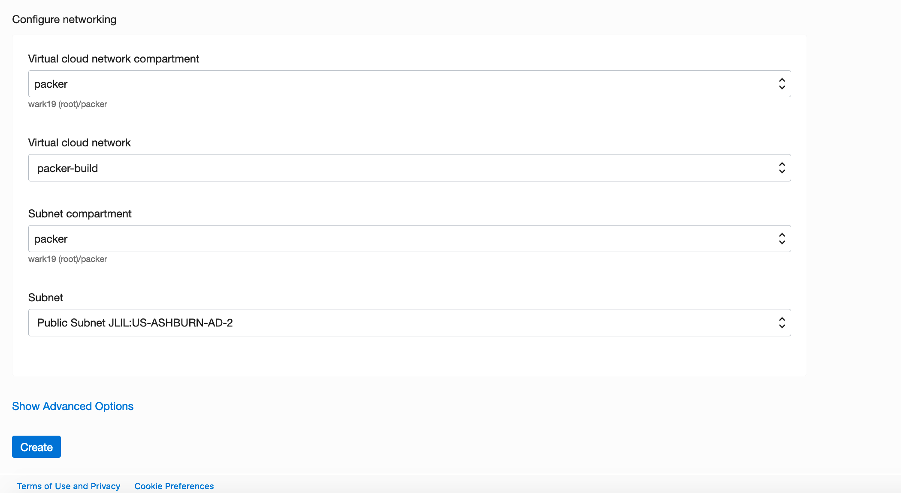

- Select **Create** You will see in the "Provisioning", state for a couple of mins as you create the boot volume and instantiate the image.  

  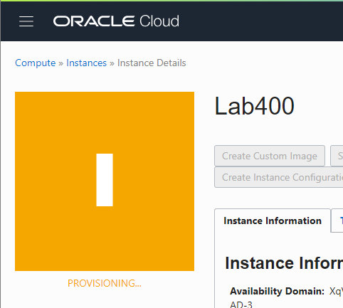

- Once provisioning completes note the public IP address of your instance, you will connect to this in the next step.

  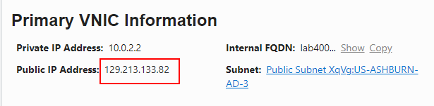

### **STEP 5**: Connect to Custom Instance

Using the IP address collected in the prior step, you could connect via ssh with your private key as you did in Lab 300. Since you installed VNCServer in your packer script, we will connect using VNC to the server running on port 5910.  

_Please note: While you can use the finder built-in (Mac), you are better using a VNC Client which allows cut-and-paste (the built-in doesn't) like Real VNC Viewer.  Real VNC Viewer is also a good choice for Windows users._

- **Open VNC Viewer** You will see the VNC Login Window, enter the VNC password you configured in Lab 200:

  

- A warning message appears since your connection is not encrypted.

  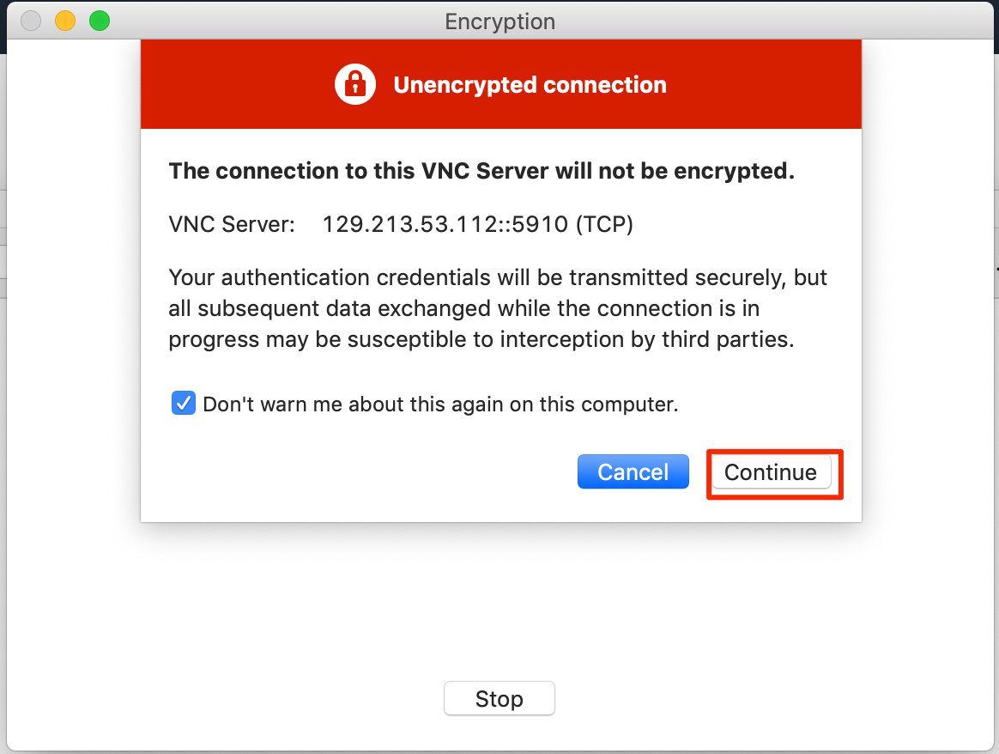

- **Click** next to complete the welcome dialog

  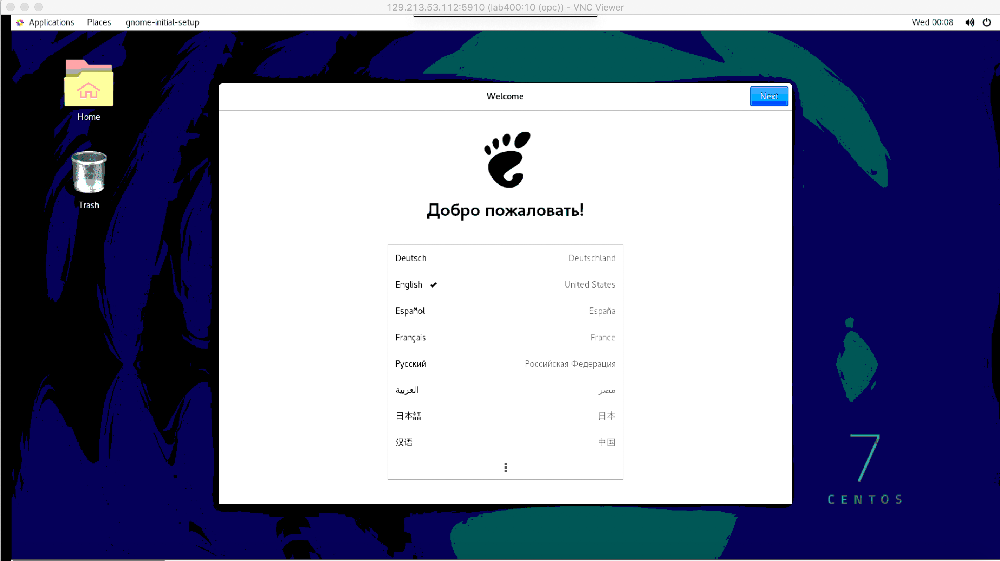

  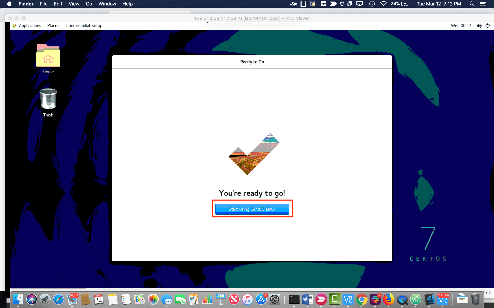

- **Launch** a terminal window by right clicking on the Desktop.


  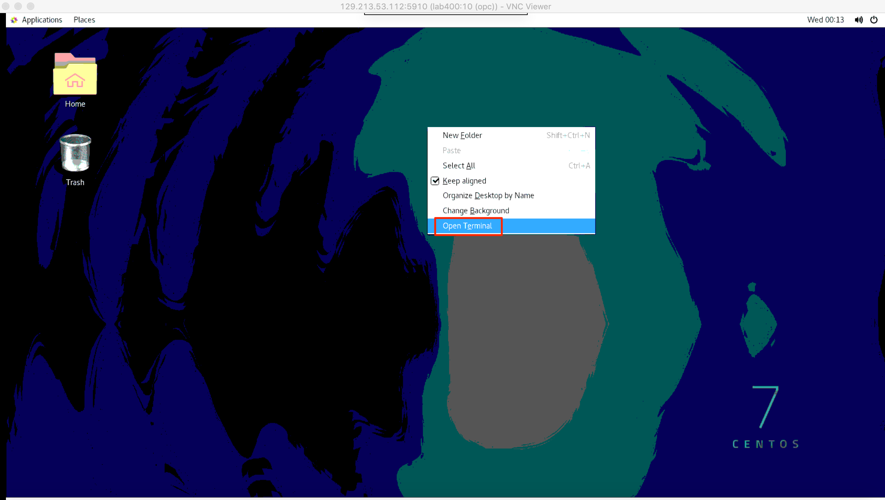

-  You will start by checking the ImageID you created to track versions. Enter the command below you should see "varBuild400":

  ```
  more .ImageID
  ```

  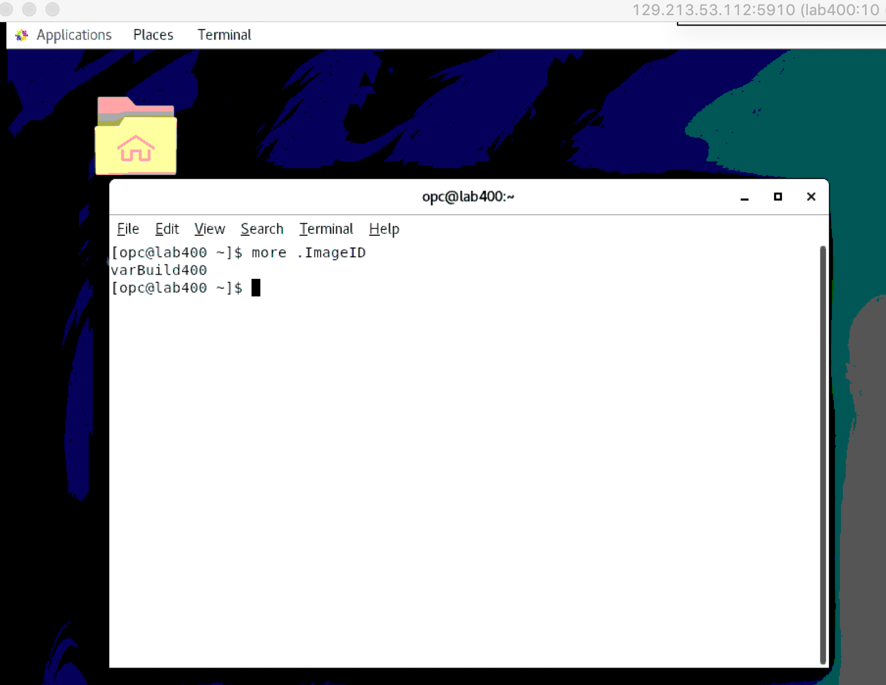

_You can see that VNCServer is starting normally, so our enabled service is work in the completed image._

### **STEP 5**: Remove API key from your user

To make certain that your environment is secure, you can easily remove the API key you added to your user by **navigating** to _Identity --> Users_

- Select your user and then the ellipses on the right, and **Delete**  

  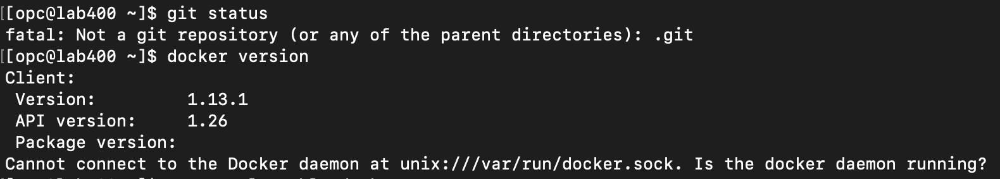

### **STEP 6**: (Optional) Remove instances

- If you'd like, navigate to the _Compute--> Instances_ Screen and remove any images running in the packer compartment you no longer need.

  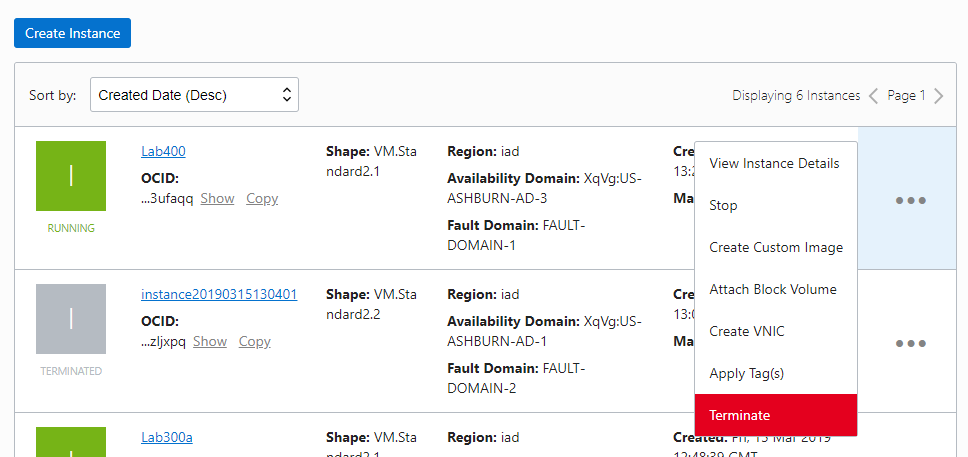

- Then check the box to permanently delete the boot volume, and **click terminate**.

  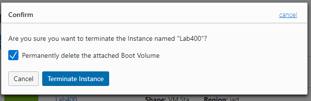

You can decide to keep or remove the Instances and custom images created (packer-builder, lab300 & lab400) as you see fit.

The are WAY more topics than can be covered in a single lab. Here are some pointers to resources than can help you learn more.

Hints:

- Always protect your keys and OCIDs as they can be used, if stolen by bad-actors, to access resources or attempt to steal data.

- Create DevDesktop.json for specific environments (tenants, compartments or subnets) files which can be shared between & across build projects.

- Start small and build up in complexity.

- Use a JSON lint-like format checker. like: https://jsonlint.com/ or an IDE editor plug-in.

- Consider services startup and timing. VNC, for instance, won't run as a service until it has been started once in an interactive shell/session.  This is why you see:

   "sudo -u opc vncserver;sleep 5"

   in the startup for varBuild400.  This allows the Xauthority file to be created as the user OPC that is then used by the Services: (vncserver@:10.service & vncserver@:11.service).

- Software that cannot be downloaded by a process (perhaps it requires a login, is behind a firewall or has a  check box to agree to a EULA), can be installed by copying the files downloaded interactively by a human (capable of accepting the License) and then copying the downloaded install files (often an rpm or zip) to an object storage bucket.


  Using a PAR (pre-authorized request), simply download using "wget" and the PAR's URL, unzip and install as normal.

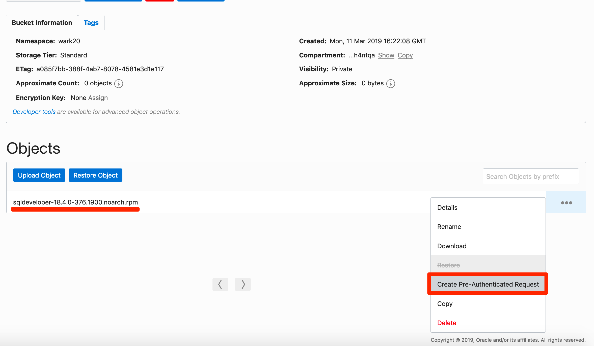

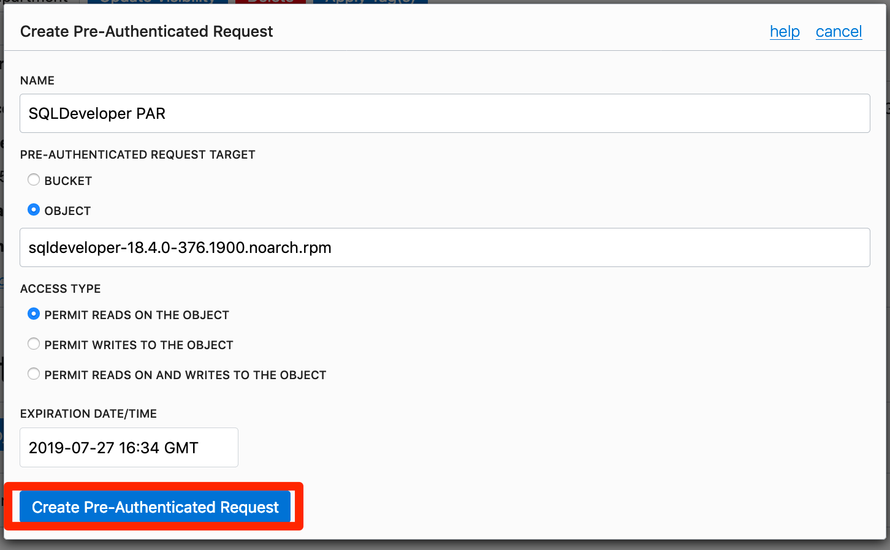

- **Copy** the PAR URL with the "copy" link:

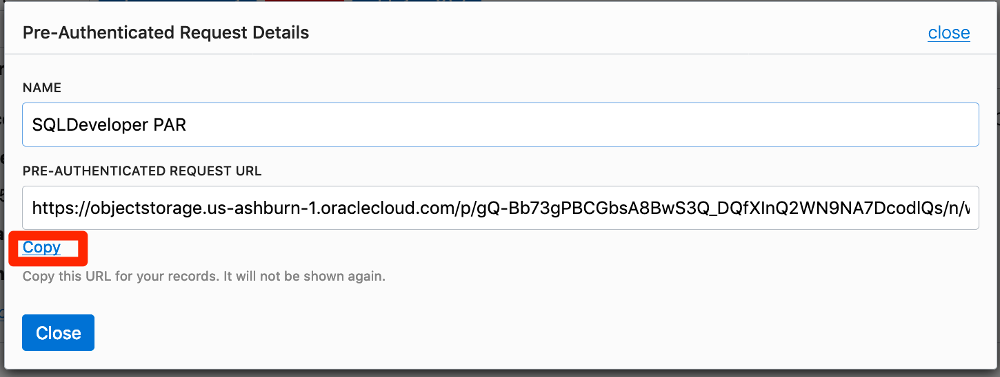

Your PAR request URL should have the format:
https://objectstorage.us-ashburn-1.oraclecloud.com/p/gQ-Bb73gPBCGbsA8BwS3Q_DQfXInQ2WN9NA7DcodlQs/n/wark20/b/Software/o/sqldeveloper-18.4.0-376.1900.noarch.rpm


**You are done with the Workshop**
