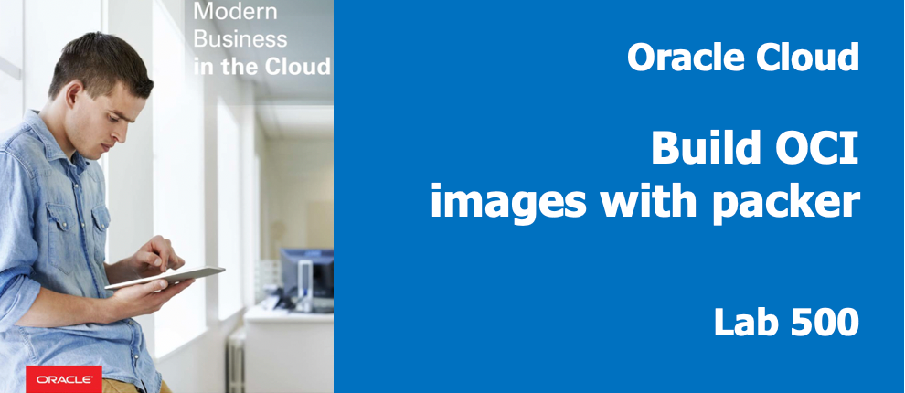
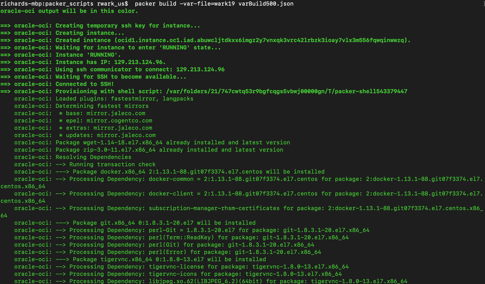
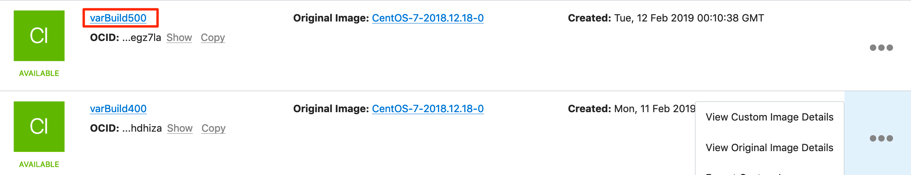
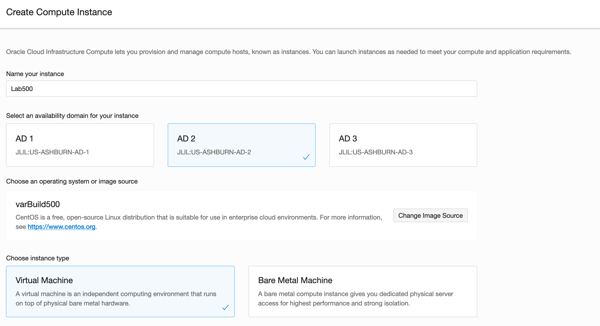
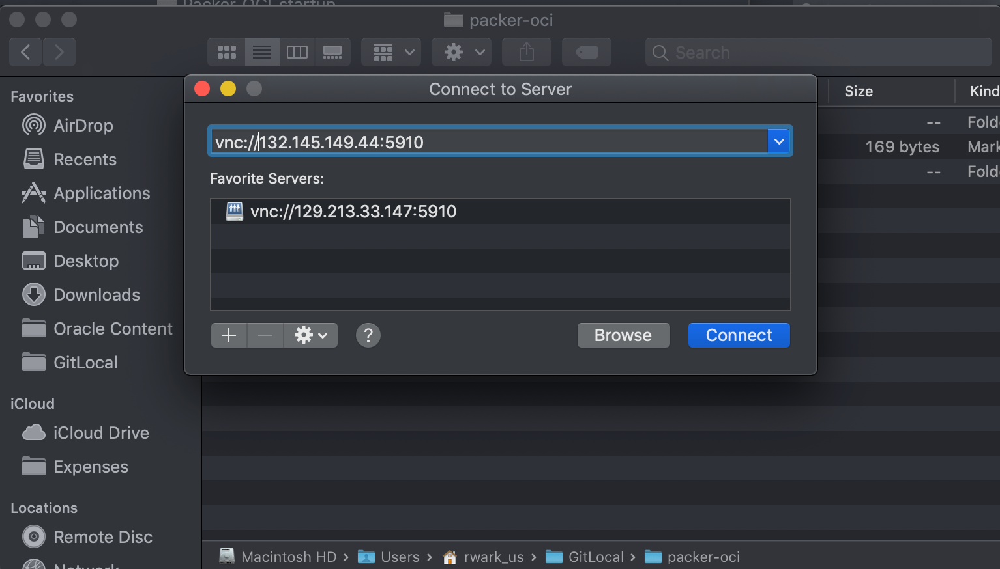
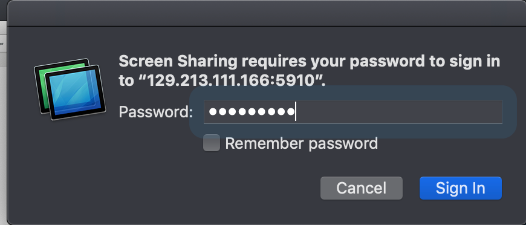
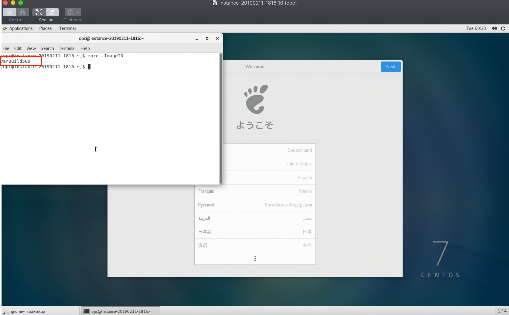
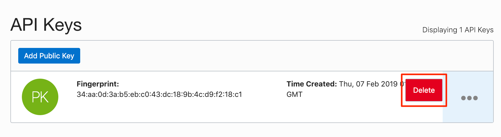

# Packer Workshop - Using Packer:  Full Docker Developer Image 



## Introduction

In this lab we grow our use of packer, install some packages, upload a configuration file and move it.  It is only incrementatally more than our previous lab, but introduces some simple concepts.
 

***To log issues***, click here to go to the [oracle github](https://github.com/oracle/learning-library/issues/new) repository issue submission form. We look forward to your questions and suggestions for improvement.

## Objectives

- Create an image with a desktop (gnome) and software installed (git, docker)
- Learn considerations for ordering of services and dependencies

## Required Artifacts

- Oracle Cloud Account - (configured in Lab100)
- Your Client Image (from lab 200) or packer & git installed locally on your laptop.
- Your git repository with "tenancyName".json and key file committed.

### **STEP 1**: Inspect varBuild500.json

We are doing the some real-world installation:

```
more varBuild500.json 
```
### **STEP 2**: Run Packer validate

- Run packer validate to make sure our file is valid
```
packer validate -var-file=<yourTenantName>.json  varBuild500.json
```

  

### **STEP 3**: Run Packer Build

```
packer build -var-file=<yourTenant>.json  varBuild500.json
```
- You can see the build process start running:

   

- You will also see the file upload process take place.
  
   
 
### **STEP 4**: Launch an Instance of your Custom Image

- Navigate to back to your browser's OCI Console to see your custom image.

- Using the elisipse to the right of the image creation time, select "Create Instance" 

  

- Select a name for the image (Lab500) and place it in Availability Domain 2 

  

- Paste or choose your public key file.

  

- Double check the compartment, VCN and subnet  

  

- Select Create

  
You will see in the "Provisioning", state for a couple of mins as we create the boot volume and instantiate the image.  

- Note the public IP address of your instance, you will connect to this in the next step.

  

### **STEP 5**: Connect to Custom Instance

- Using the IP address, Connect using VNC to the server installed on port 5910.  You can use the finder built-in (Mac/Linux) or with Real VNC Viewer(Windows)

  

- You should get the VNC Login Window, enter the password you configured in Lab 200:

  

- Again, we will start by checking the ImageID we created to track versions.  We should see "varBuild500":

  - Launch a terminal window:

```
more .ImageID
```
  - Launch Terminal 
  

We can see that docker is starting normally, so our enabled service should work in the completed image.

### **STEP 5**: Remove API key from your user

To make certain that your environment is secure, you can easily remove the API key you added to your user by **navigating** to Identity --> Users

- Select your user and then the ellipses on the right, and **Delete**  

  

You can decide to keep or remove the custom images created (packer-builder, lab300, lab400 and lab500) as you see fit.

The are WAY more topics than we can cover in a single lab. Here are some pointers to resources than can help you learn more.

 Hints:

  - Always protect your keys and OCIDs as they can be used, if stolen by bad-actors, to use resources or attempt to steal data.

  - create variables.json for specific environments (tenants, compartments or subnets) files which can be shared across builds.
  
  - Start small and build up in complexity.

  - Use a JSON lint-like format checker. like: https://jsonlint.com/ or an IDE editor plug-in.

**You are done with the Workshop**