# Docker on Windows in the Oracle Cloud

Updated: November 5, 2018

## Introduction

This document is a broad brush flow regarding hands-on Docker experience if customers decide they’d like to look at a .NET Core application (in this example an ASP app) running in the Oracle Cloud. This will cover options for Linux and Windows instances running in a Compute Cloud Service.
**NOTE: Oracle trial accounts will only be able to run Linux and Windows 2016 (VM) versions as they no longer include Bare Metal shapes**. As such the preferred Windows Docker usage of running Linux Docker containers on top of `Hyper-V` cannot be done in the trial accounts (This option is still documented here). However, the `Docker Toolbox for Windows` option can be shown from a Windows 2016 Standard VM shape. Both Docker for Windows variations are shown here for completeness.

This document is not a step by step flow to the entire end game. Rather, it assumes familiarity with OCI, Docker and Windows.

### Exploring some Options

[Bring your Windows image to the Oracle Cloud](https://blogs.oracle.com/cloud-infrastructure/bring-your-own-image-of-windows-server-to-oracle-cloud-infrastructure)

[Windows 2016 Datacenter on the Oracle Cloud](https://blogs.oracle.com/cloud-infrastructure/windows-server-2016-datacenter-on-oracle-cloud-infrastructure)

## Running an ASP .NET Core app on Oracle Linux 7.x:

- Using the compute instance from the Docker workshop run the following docker command:

  ```
  docker run -d -p 80:80 --name aspdotnet wvbirder/aspdotnet
  ```

- Open up a browser and go to the Linux VM’s public IP address:

  The docker image was created with a DockerFile located in the same directory as the application source for the ASP application. It was then pushed to DockerHub as wvbirder/aspdotnet.

  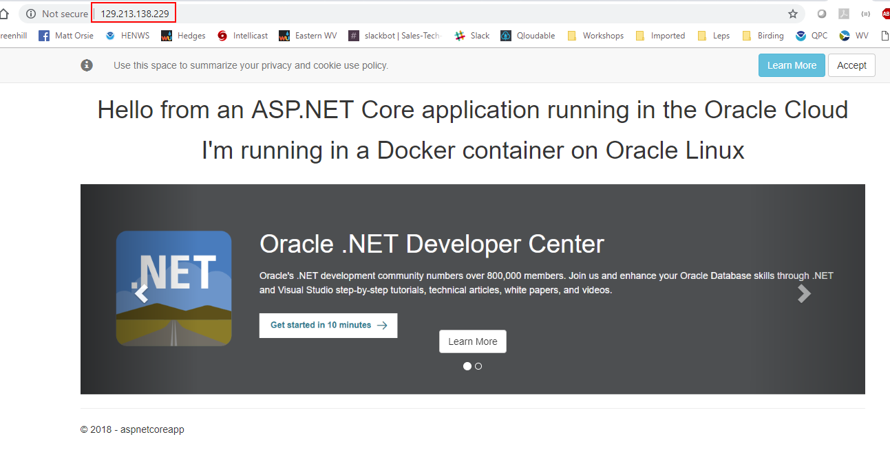

- Bash into the running container to see some of the ASP application specifics.

  ```
  docker  exec –it aspdotnet  bash
  ```

- Type **exit** to leave the container.

- You’ll see the application contents, etc.

  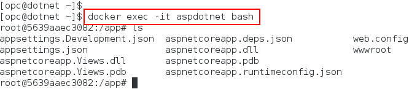

- Showing the contents of `aspnetcoreapp.runtimeconfig.json`:

  ```
  root@5639aaec3082:/app# more *runtime*   
  {
    "runtimeOptions": {
      "tfm": "netcoreapp2.1",
      "framework": {
        "name": "Microsoft.AspNetCore.App",
        "version": "2.1.1"
      },
      "configProperties": {
        "System.GC.Server": true
      }
    }
  }
  ```

## Flow to Create this Application and then Dockerize

- Install the [.NET Core SDK](https://www.microsoft.com/net/download) for Windows, macOS, or Linux.

- Create a new ASP .NET Core application.

  ```
  dotnet new webApp -o aspnetcoreapp
  cd aspnetcoreapp
  ```

-	Install the HTTPS development certificate.

    ```
    dotnet dev-certs https –trust
    ```

- Run the application locally.

   ```
   dotnet run
   ```
  
- In a browser go to: **https://localhost:5001**

  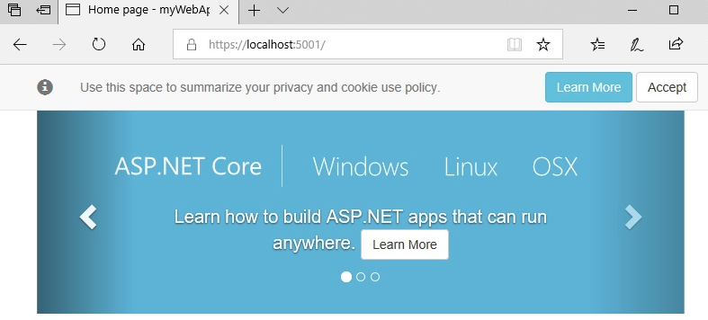

- Now, add a **Dockerfile** (File name is case sensitive) into the directory with the follow contents. You can **Copy and Paste**:

  ```
  FROM microsoft/dotnet:sdk AS build-env
  WORKDIR /app
  
  # Copy csproj and restore as distinct layers
  COPY *.csproj ./
  RUN dotnet restore
  
  # Copy everything else and build
  COPY . ./
  RUN dotnet publish -c Release -o out
  
  # Build runtime image
  FROM microsoft/dotnet:aspnetcore-runtime
  WORKDIR /app
  COPY --from=build-env /app/out .
  EXPOSE 80/tcp
  ENTRYPOINT ["dotnet", "aspnetcoreapp.dll"]
  ```

- Create a **.dockerignore** (There is a period at the front of the filename) file in the same directory to exclude unwanted binary / build files. This reduces the Docker image size. Put the following in the file:

  ```
  bin\
  obj\
  ```

-	The contents of the directory will look like:

    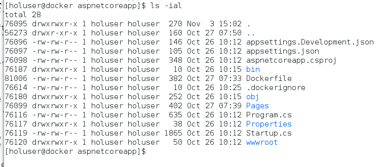

- Build the Docker image: **( Don’t forget the period . )**

  ```
  docker build -t aspnetcoreapp .
  ```

- Example Outout:

  ```
  docker build -t aspnetcoreapp .
  Sending build context to Docker daemon  4.518MB
  Step 1/11 : FROM microsoft/dotnet:sdk AS build-env
   ---> 6baac5bd0ea2
  Step 2/11 : WORKDIR /app
   ---> 4c545e370389
  Removing intermediate container 5b1dcc3f60e0
  Step 3/11 : COPY *.csproj ./
   ---> 233a7569671e
  Removing intermediate container a31830f912c2
  Step 4/11 : RUN dotnet restore
   ---> Running in fc8dcbf2eb26
    Restoring packages for /app/aspnetcoreapp.csproj...
    Generating MSBuild file /app/obj/aspnetcoreapp.csproj.nuget.g.props.
    Generating MSBuild file /app/obj/aspnetcoreapp.csproj.nuget.g.targets.
    Restore completed in 3.63 sec for /app/aspnetcoreapp.csproj.
   ---> 72b0eff319b0
  Removing intermediate container fc8dcbf2eb26
  Step 5/11 : COPY . ./
   ---> 4067965d6250
  Removing intermediate container 597453a00221
  Step 6/11 : RUN dotnet publish -c Release -o out
   ---> Running in 159ded68d1a9
  Microsoft (R) Build Engine version 15.8.169+g1ccb72aefa for .NET Core
  Copyright (C) Microsoft Corporation. All rights reserved.
  
    Restoring packages for /app/aspnetcoreapp.csproj...
    Generating MSBuild file /app/obj/aspnetcoreapp.csproj.nuget.g.props.
    Generating MSBuild file /app/obj/aspnetcoreapp.csproj.nuget.g.targets.
    Restore completed in 4.73 sec for /app/aspnetcoreapp.csproj.
    aspnetcoreapp -> /app/bin/Release/netcoreapp2.1/aspnetcoreapp.dll
    aspnetcoreapp -> /app/bin/Release/netcoreapp2.1/aspnetcoreapp.Views.dll
    aspnetcoreapp -> /app/out/
   ---> 5739f62dec78
  Removing intermediate container 159ded68d1a9
  Step 7/11 : FROM microsoft/dotnet:aspnetcore-runtime
   ---> 1fe6774e5e9e
  Step 8/11 : WORKDIR /app
   ---> Using cache
   ---> 61b764b4d413
  Step 9/11 : COPY --from=build-env /app/out .
   ---> 48f3a19b8c7c
  Removing intermediate container 3a0646463675
  Step 10/11 : EXPOSE 80/tcp
   ---> Running in e9003bb9e1aa
   ---> 04421c88e77b
  Removing intermediate container e9003bb9e1aa
  Step 11/11 : ENTRYPOINT dotnet aspnetcoreapp.dll
   ---> Running in 2bc34a127eaf
   ---> ce7c422a70e1
  Removing intermediate container 2bc34a127eaf
  Successfully built ce7c422a70e1
  Successfully tagged aspnetcoreapp:latest
  ```

- The Docker image is created. Now, create a new container based on the image. Verify using **docker ps**.

  ```
  docker run -d -p 80:80 --name aspdotnet aspnetcoreapp
  ```

    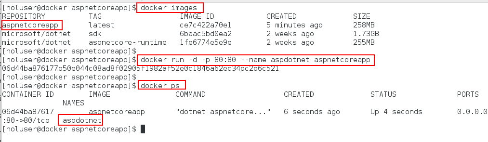

- Verify the application is running: (Go to the public IP address or, if the browser is on the local machine, use http://localhost)

## Running in OCI on a Windows 2016 Standard VM 

This option uses `Docker Toolbox for Windows` (Which includes VirtualBox and a bash shell)

- Create a `Windows 2016 Standard` Compute instance using a VCN you already have in place. **Note the Public IP address and the Initial Password for the opc user**

  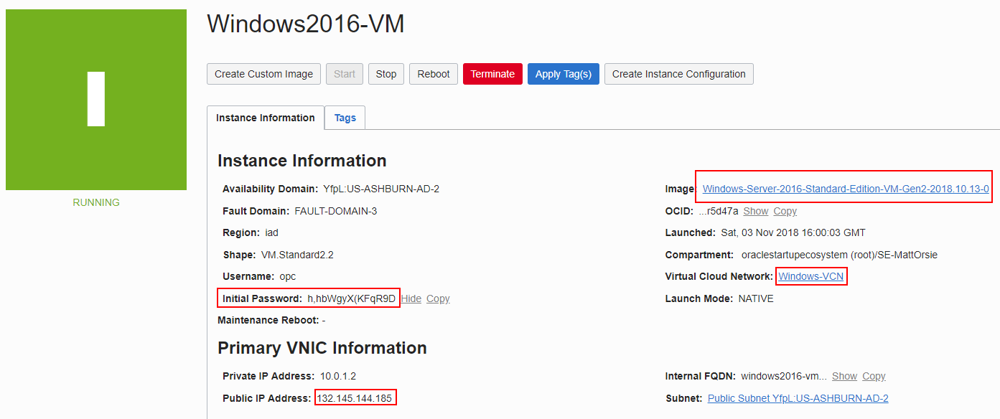

- Go to your VCN default **Security List** and **open port 3389** in the Ingress Rules (RDP uses port 3389)

  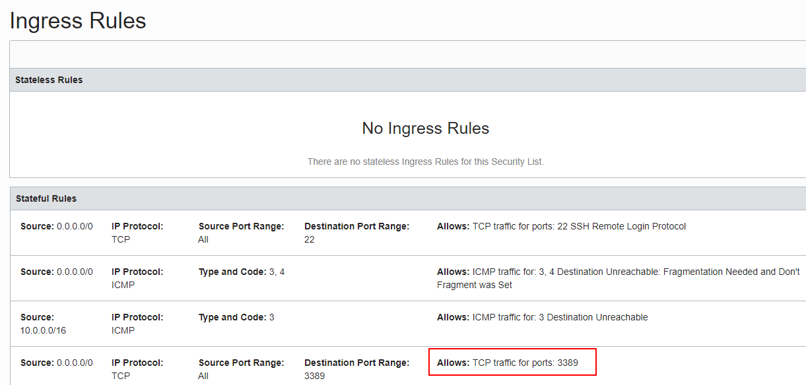

- Using RDP login into your new instance. You’ll be prompted for the Initial password and to change the password for the opc user. Change it and log in.

  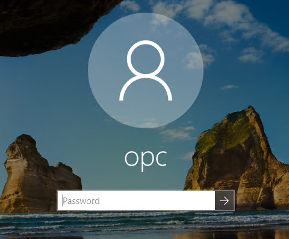

- Using Internet Explorer add **https://*.google.com** and **https://*.docker.com** as `Trusted Sites` in the browser Internet Security options:

  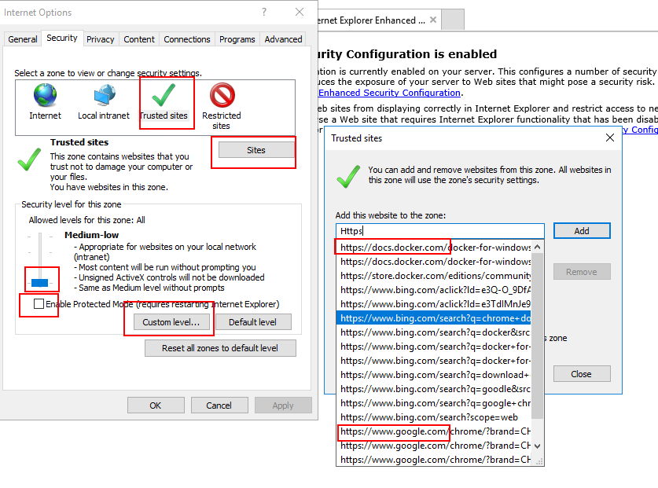

- In this example we downloaded and installed `Chrome` and then `Docker Toolbox for Windows`. Decided to use Chrome instead of IE.

- Once `Docker Toolbox for Windows` is installed double click the **Docker Quickstart** desktop icon. 

  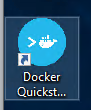

- This will configure a VirtualBox image and do an initial setup. It obtains a local IP address from DHCP and assigns to the Docker Linux image running in vBox:

  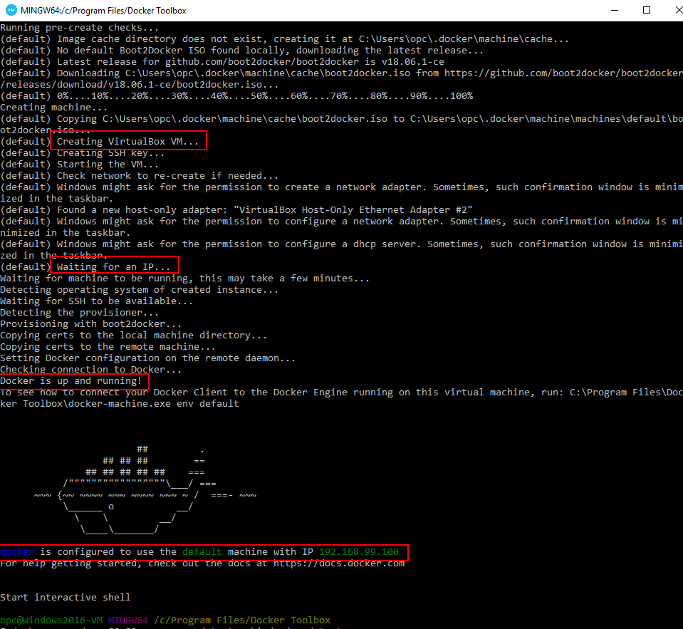

- Run the aspdotnet application.

  ```
  docker run -d -p 80:80 --name aspdotnet wvbirder/aspdotnet
  ```

  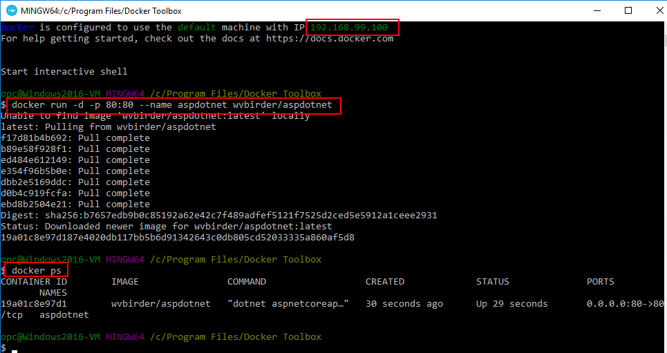

- Test in a local browser using the IP address: (The default IP using `Docker Toolbox for Windows` will be: **192.168.99.100**)

  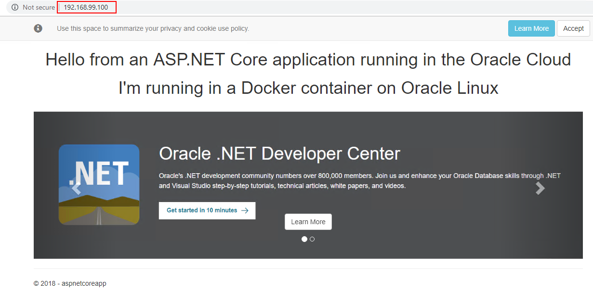

## Running in OCI on Windows 2016 DataCenter using Bare Metal 

This option uses `Docker for Windows`  running on top of Hyper-V

- Create a `Windows 2016 Datacenter` Compute instance on Bare Metal using a VCN you already have in place. **Note the Public IP address and the Initial Password for the opc user**

  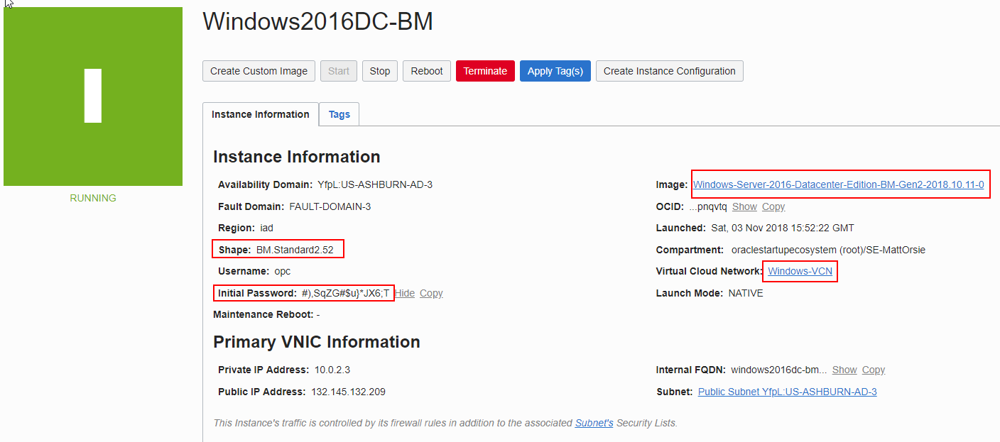

- Go to your VCN default **Security List** and **open port 3389** in the Ingress Rules (RDP uses port 3389)

  

- Using RDP login into your instance. You’ll be prompted for the Initial password and to change the password for the opc user. Change it and log in.

  

- Using Internet Explorer add **https://*.google.com** and **https://*.docker.com** as Trusted Sites in the browser Internet Security options:

      

- **Enable Hyper-V** by going into **Server Manager** and enabling that Role: (Make sure you select the virtual VNIC (checkbox) during this multi-step enablement. After configuration and reboots Hyper-V will show up in the **Roles and Server Groups** section)

  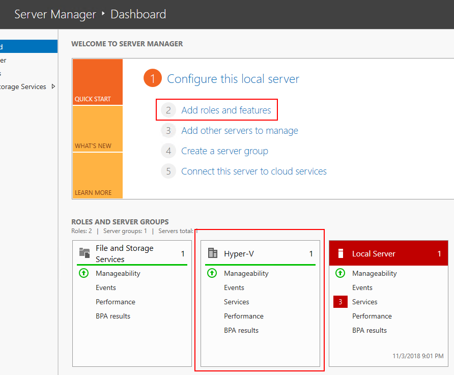

- At this point the system requires reboots to install and enable the Hyper-V service.

- After the reboot, login and you can verify seeing Hyper-V **Running** as a System Service:

  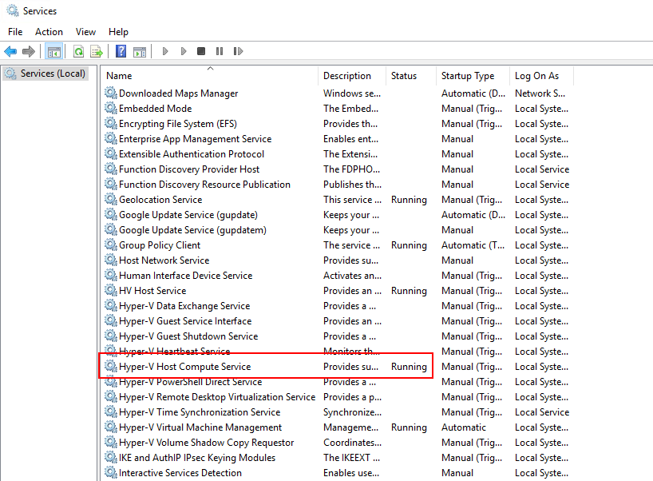

- Once Hyper-V is enabled you will download and install [Docker for Windows](https://docs.docker.com/docker-for-windows/install/)

  

- If the installation and setup go OK the **System Tray** will show Docker as running:

  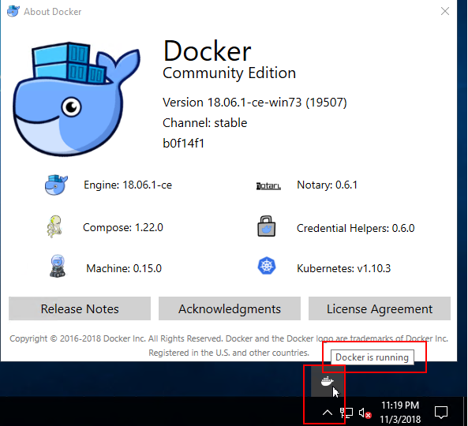

- **Open up a Powershell** and verify the Docker installation by checking the version. Then, run the **aspdotnet** application.

  ```
  docker version
  docker run -d -p 80:80 --name aspdotnet wvbirder/aspdotnet
  ```

  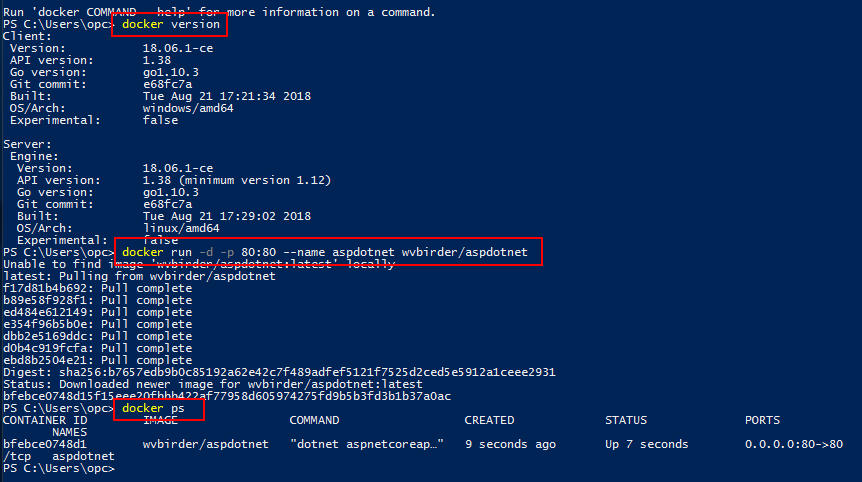

- Going to **localhost** in the local browser confirms:

  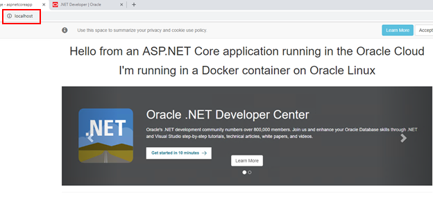


# Where do I go from here?

Check out the [Oracle .NET Developer Center](https://www.oracle.com/database/technologies/appdev/dotnet.html)


